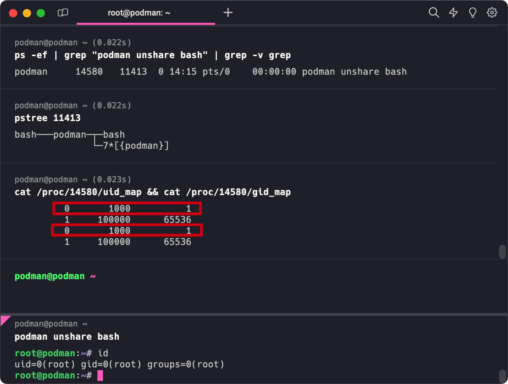

# 云原生安全资讯: podman unshare 介绍

开始前说2个搭建环境的小坑

坑1：不要用 lxc 容器跑，用虚拟机跑没那么多问题

坑2：最好不要直接用 su 切到普通用户，见 [Solved: Podman Rootless - Red Hat Learning Community](https://learn.redhat.com/t5/Containers-DevOps-OpenShift/Podman-Rootless/td-p/31095)

## podman unshare 命令参数

命令格式：**podman unshare** [ *options* ] [ *command* ]

```bash
> podman -v
podman version 3.4.4
> podman unshare -h
Run a command in a modified user namespace

Description:
  Runs a command in a modified user namespace.

Usage:
  podman unshare [options] [COMMAND [ARG...]]

Examples:
  podman unshare id
  podman unshare cat /proc/self/uid_map,
  podman unshare podman-script.sh

Options:
      --rootless-cni   Join the rootless network namespace used for CNI networking

```

## podman-unshare 说明

`podman unshare` 命令在新的用户命名空间以 "root" 身份执行命令，并且通过 [newuidmap(1)](https://man7.org/linux/man-pages/man1/newuidmap.1.html) 和 [newgidmap(1)](https://man7.org/linux/man-pages/man1/newgidmap.1.html) 把UID和GID为0

```bash
> podman unshare id
uid=0(root) gid=0(root) groups=0(root)
```

这个 "root" 并不是真正意义上的 root，只是通过 [user_namespaces(7)](https://man7.org/linux/man-pages/man7/user_namespaces.7.html) 对 uid 和 gid 作了一个映射而已



比如我们查看一下 `/etc/shadow` 文件还是权限不足的

```bash
root@podman:~# cat /etc/shadow
cat: /etc/shadow: Permission denied
```

`podman-unshare` 和原生的 `unshare `的直观区别就是 `podman-unshare` 需要以非root用户运行

```bash
> unshare whoami
root
> podman unshare whoami
Error: please use unshare with rootless
```

而原生 `unshare` 则没有这个限制，可以用 root 用户运行

那 `podman-unshare` 有什么用呢？

`podman-unshare` 在实现（运行） rootless 容器时起到关键的作用，如一些操作Linux内核只允许在用户命名空间root用户进行操作，如挂载 procfs、sysfs、tmpfs、fusefs 和 bind 挂载

```bash
> mount proc ./test -t proc
mount: /home/podman/test: must be superuser to use mount.
```

在执行 `podman mount` 时，也需要进入用户命名空间root，非否会执行失败

```bash
> podman mount
Error: cannot run command "podman mount" in rootless mode, must execute `podman unshare` first
> podman unshare bash
root@podman:~# podman mount
root@podman:~#
```

此外，`podman unshare` 在非特权用户对排障和清除与镜像、容器相关对数据时也比较有用

执行 `podman unshare` 会设置两个环境变量

* **CONTAINERS_GRAPHROOT：**容器持久化数据目录
* **CONTAINERS_RUNROOT：**容器临时数据目录

> ⚠️ 注意：此命令不适用于远程Podman客户端

## podman unshare 返回值

podman unshare 的返回值提供有关容器运行失败或退出原因的信息。 当 podman unshare 命令以非零值退出时，返回值遵循 chroot 标准，如下所示：

**125** 表示错误出在 podman 本身

```bash
$ podman unshare --foo; echo $?
Error: unknown flag: --foo
125
```

**126** 表示执行输入的命令，但该命令无法调用

```bash
$ podman unshare /etc; echo $?
Error: fork/exec /etc: permission denied
126
```

**127** 表示执行输入的命令但找不到该命令

```bash
$ podman unshare foo; echo $?
Error: fork/exec /usr/bin/bogus: no such file or directory
127
```

**退出代码** 包含命令的退出代码

```bash
$ podman unshare /bin/sh -c 'exit 3'; echo $?
3
```

## 拓展

**[podman(1)](https://github.com/containers/podman/blob/main/docs/source/markdown/podman.1.md)** ,  **[podman-mount(1)](https://github.com/containers/podman/blob/main/docs/source/markdown/podman-mount.1.md)** ,  **namespaces(7)** ,  **newuidmap(1)** ,  **newgidmap(1)** , **user_namespaces(7)**
