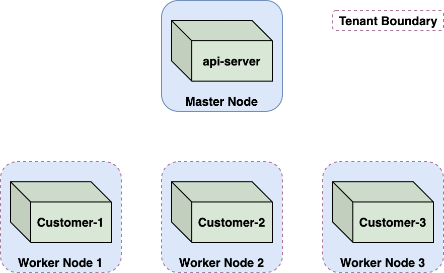
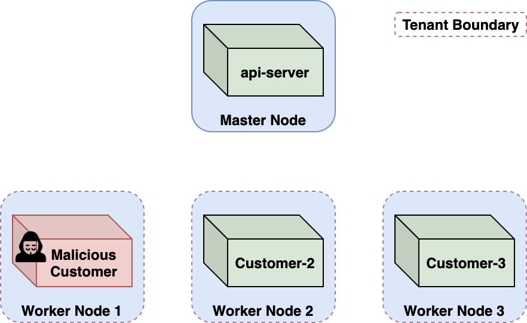
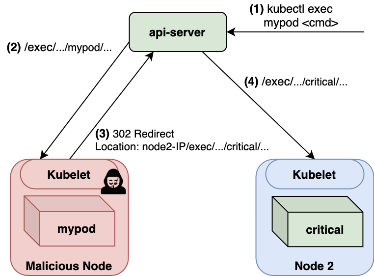
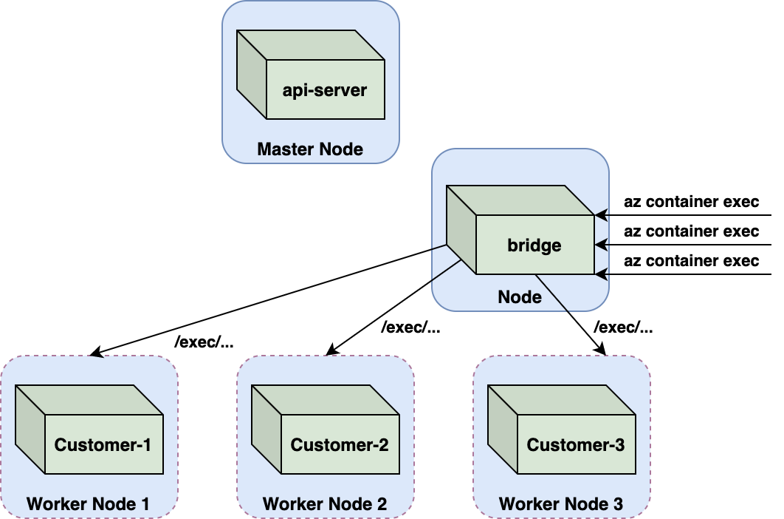
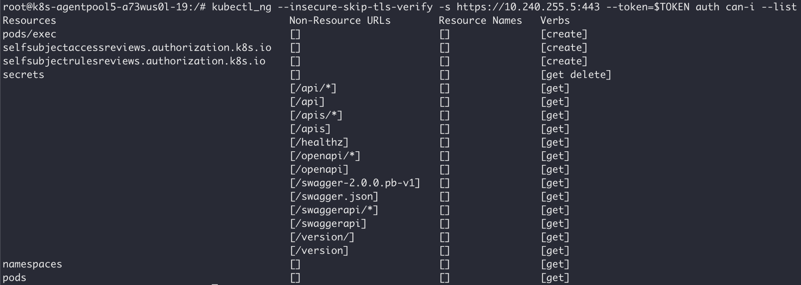

---

tags: Cloud Native Security News,云漏洞案例,Azure
author: tarimoe
spec_version: v0.1.2
version: v0.1.1
changelog:
  - v0.1.1: update filename, metadata

---

# Azure容器实例中首次跨租户容器接管漏洞（上）

> 原文地址: https://unit42.paloaltonetworks.com/azure-container-instances/

原本只想简要总结这里的两种攻击路径，但发现学到了不少东西，而且在 k8s 集群多租户安全中挺经典的，为了方便以后随时无障碍阅读，就干脆整篇翻译下来了，有错误欢迎各位师傅指正。由于篇幅较长，本文分为上下两章分别讲解 Azure 容器服务在 2021 年爆出的两个漏洞：
+ （上）即本文注重讲解第一个漏洞
+ （下）讲解第二个漏洞、如何预防 k8s 类似攻击和个人总结

## 1.1 摘要
[ACI（Azure Container Instances）](https://azure.microsoft.com/en-us/services/container-instances/) 是 Azure 提供的容器即服务（CaaS）产品，它允许用户在 Azure 上以较低成本运行容器，无需关心底层服务器的管理。近期，Unit 42 的研究人员在 ACI 中发现了一些严重的安全漏洞，并已向 Microsoft 报告。通过这些漏洞，恶意用户本能够在其他用户的容器上执行代码、窃取在该平台部署的敏感数据和镜像，并能将 ACI 的基础设施用于加密货币挖矿。研究人员将此漏洞命名为 Azurescape，这是公有云领域首次发现跨账户容器接管的案例。

Azurescape 允许恶意用户攻击托管 ACI 的多租户 Kubernetes 集群，从而完全控制其他用户的容器。本文将介绍这一研究过程，分析了问题所在，并提出了一些保护 Kubernetes 的最佳实践，特别强调了多租户环境的安全措施，以帮助防范此类攻击。

在 Unit 42 报告漏洞后不久，Microsoft 紧急修复了 ACI。Unit 42 并未了解到 Azurescape 在实际环境中被利用的案例。作为预防措施，如果您在 ACI 上运行容器，Unit 42 建议撤销所有在 2021 年 8 月 31 日之前部署到该平台的高权限凭证，并检查访问日志以寻找任何异常活动。

如果你希望简单了解 Azurescape 的概况，可参阅另一篇文章：[“关于 Azurescape，您需要了解的事项”](https://www.paloaltonetworks.com/blog/2021/09/azurescape/)。


## 1.2 背景

ACI 于 [2017 年 7 月推出](https://azure.microsoft.com/en-us/blog/announcing-azure-container-instances/)，是第一个由主流云服务提供商推出的容器即服务（CaaS）产品。ACI 负责容器的自动扩展、请求路由和调度，为用户提供了一种无服务器（Serverless）的容器使用体验。

Azure 的官网这样描述 ACI：“无需管理虚拟机或学习复杂工具，快速开发应用程序 - 应用程序在容器中，并在云端运行。”

在技术架构上，ACI 是基于多租户集群构建的，这些集群负责托管客户的容器。最初，ACI 是基于 Kubernetes 集群构建的，但在过去一年里，Microsoft 也开始使用 [Service Fabric](https://azure.microsoft.com/en-us/products/service-fabric) 集群来托管 ACI。本文讨论的问题影响的是 Kubernetes 上运行的 ACI，因此下文将主要讨论这一架构。根据 Unit 42 的测试，平台上部署了数千个容器，在披露这些问题时，大约 37% 的 ACI 新创建的容器是由 Kubernetes 托管的。



在 ACI 这样的多租户环境中，维护租户间的严格隔离至关重要。在 ACI 中，这种隔离是通过节点虚拟机来实现的。每个客户的容器都运行在一个专用的、单租户的节点上，每个节点对应一个 Kubernetes pod。这种每个租户分配一个节点的 Kubernetes 多租户模式通常被称为“每租户一个节点”模式。

## 1.3 Azurescape 攻击场景分析
ACI 设计之初就考虑到了防御恶意用户的需要。由于实际上任何人都可以在平台上部署容器，ACI 必须确保恶意容器不能干扰、泄露信息、执行代码或以其他方式影响其他客户的容器。这些攻击通常被称为跨账户或跨租户攻击。



Unit 42发现了一种跨租户攻击方法，通过这种方法，恶意的 Azure 用户可以从自己的容器中逃逸出来，获取一个具有高权限的 Kubernetes 服务账户令牌，并进而控制 Kubernetes [api-server](https://kubernetes.io/docs/concepts/overview/components/#kube-apiserver)。这样一来，他们就能完全控制多租户集群以及集群内运行的所有客户容器。

## 1.4 当前容器逃逸到 K8S Node 节点宿主机
CaaS 产品的安全性探究一直颇具挑战。用户通常只能接触到自己的容器环境，并且通过防火墙限制了对本地网络的访问。为了更深入地理解 CaaS 平台是如何运行租户容器，Unit 42 使用 [WhoC](https://github.com/twistlock/whoc) ，一个特殊的容器镜像，它能够读取执行它的容器运行环境。它基于是 Linux 容器中冷门设计缺陷，允许容器读取底层宿主机的容器运行时。这个想法类似于 CVE-2019-5736 漏洞，但区别在于我们的目的是读取宿主的运行时，而不是修改它。

通过在 ACI 上部署 WhoC，Unit 42 成功获取了平台所用容器的运行时信息。如 Unit 42 所料，运行时是行业标准的容器运行时 [runC](https://github.com/opencontainers/runc)。然而，比较出乎意料的是它的版本，如图 3 所示。

```shell
./aci_container_runtime -v
```


RunC v1.0.0-rc2 发布于 2016 年 10 月 1 日，它至少存在两个已知的容器逃逸 CVE 漏洞。在 2019 年，Unit 42 分析过其中的一个漏洞 [“通过 runC 逃离 Docker – 解释 CVE-2019-5736”](https://unit42.paloaltonetworks.com/breaking-docker-via-runc-explaining-cve-2019-5736/) ，里面分享一个针对它的概念验证 (PoC) 漏洞利用方法。

> 🐮 这个漏洞我刚好也有复现 [runC容器逃逸-CVE-2019-5736复现](https://tari.moe/p/2023/CVE-2019-5736.html)，不过没想道可以这样去获取 runC版本 

当发现 ACI 中使用了这个旧版本的 runC 后，Unit 42 基于之前开发的 PoC 容器镜像进行了改进，部署到了 ACI 上并成功进行容器逃逸。在容器当前K8S Node节点宿主机获取 root  Shell 权限。


虽然逃离了容器，但我们仍然处于租户边界之内 —— 即节点 VM。CaaS 平台的设计能够抵御利用内核漏洞实现权限提升和容器逃逸。恶意容器的逃逸被视为一种相对预期的威胁，并通过节点级别的隔离进行管理。


## 1.5 节点信息收集
在进行节点信息收集时，Unit 42 使用 [Kubelet](https://kubernetes.io/docs/concepts/overview/components/#kubelet) 的凭证，列出了集群中的 pod 和节点，确认了容器是该节点上唯一的客户容器。这个集群托管了约 100 个客户 pod，并拥有大约 120 个节点。每个客户被分配到一个专属的 Kubernetes 命名空间中运行他们的 pod；我们的命名空间名为 caas-d98056cf86924d0fad1159XXXXXXXXXX。

这些节点的 Kubelet 允许匿名访问。因此，Unit 42 尝试访问其他节点上的 Kubelets，但所有请求都因超时而失败，这应该是防火墙配置阻止了节点之间的通信。

每个节点上都有一个指向集群名称的引用，在 kubernetes.azure.com/cluster 标签中，格式为：CAAS-PROD-<LOCATION>-LINUX-<ID>。


Unit 42 部署了一些逃逸容器，并发现它们落在了不同的 Kubernetes 集群上。我们发现，每个集群都有一个独特的集群 ID，这些 ID 在 1 到 125 之间变化，这说明每个地区（如西欧地区）可能托管了几十个不同的集群。

## 1.6 收集 K8S nday 信息
```shell
kubectl version
```


## 1.7 尝试利用 K8S CVE-2018-1002102
api-server 会不定期与 Kubelets 进行通信。例如，当执行 `kubectl exec <pod> <cmd>` 命令时，api-server 会将这个请求转发到相应的 Kubelet 的 `/exec` 接口。

CVE-2018-1002102 揭示了 api-server 与 Kubelets 通信时存在任意URL重定向漏洞。通过重定向 api-server 的请求到另一个节点的 Kubelet，一个恶意的 Kubelet 可以在集群中利用此漏洞。图 8 显示了这个漏洞的基本流程：



利用此漏洞需要满足以下前提条件：
- 存在漏洞的 api-server 版本：✓
- 被入侵的节点：✓
- 使 api-server 访问被入侵节点。例如，可以通过对受控节点上的 pod 执行 kubectl exec 命令来实现 :？

显然，ACI 也满足了第三个条件。ACI 支持通过 `az container exec` 命令在容器中[执行命令](https://docs.microsoft.com/en-us/cli/azure/container?view&#61;azure-cli-latest#az_container_exec)，这与 `kubectl exec` 的功能类似。

```shell
az container exec --name <my-container> --exec-command <command>
```

接着创建了一个利用 CVE-2018-1002102 的自定义 Kubelet 镜像，将接收到的 exec 请求重定向到其他节点上的 pod。为了提高危害，Unit 42 将其配置为目标指向 api-server pod，然后运行 `az container exec my-ctr --exec-command /bin/bash`，期望在 api-server 容器上建立一个 shell，但利用失败了。

实际利用 Unit 42 发现重定向操作仅在目标容器和当前容器位于同一节点上时才有效，无法影响其他节点。看了一下 [CVE-2018-1002102 的补丁](https://github.com/kubernetes/kubernetes/pull/66516)后，发现漏洞修复就是这样。但奇怪的是 api-server 是存在漏洞版本，不明白为啥已经修复了（老外难道不喜欢 patch 的吗，然后主版本死活不肯升级）。

再次确定发送到节点的 exec 请求，我们原本预期这些请求会来自 api-server 的 IP，如图 8 所示。但请求 IP 实际上来自一个在默认命名空间运行的名为 k8s-agentpool1（下文用 'bridge' 代称） 的 pod。


ACI 将 `exec` 请求处理从 api-server 转移到了一个自定义服务。应该是通过将 `az container exec` 命令的路由指向 bridge pod，而不是直接发往 api-server 来实现的。



bridge 镜像的标签是 `master_20201125.1`，表明它在 CVE-2018-1002102 发布后更新。从它的最新构建时间和拒绝重定向 `exec` 请求来看，看起来 CVE-2018-1002102 的补丁被移植到了 bridge pod。看来微软意识到这个漏洞会影响他们的自定义bridge pod 并给它打上了补丁，整挺好！

值得一提的是，CVE-2018-1002102 还可以在其他场景下被利用，例如，当请求恶意 Kubelet 提取容器日志（比如使用 kubectl logs 命令）时。这对 ACI 来说实际上是相关的，因为这个功能是通过 `az container logs` [命令](https://docs.microsoft.com/en-us/cli/azure/container?view=azure-cli-latest#az_container_logs)实现的。但就像 `exec` 请求一样，ACI 将日志检索的处理委托给了一个专门的名为 `log-fetch` 的 pod。与 bridge pod 一样，CVE-2018-1002102 的补丁也被移植到了 `log-fetch` pod

## 1.8 逃逸至 Cluster Admin 权限
由于 CVE-2018-1002102 利用不了，但在调试过程中，Unit 42注意到一个不寻常的情况：即从 brige pod 请求 至 K8S Node节点的 `exec` HTTP请求中包含了一个 `Authorization` 头部，携带着一个 Kubernetes 服务账户令牌，如图 11 所示。


在这里发现令牌是出乎意料的。正如前文所述，集群中的 Kubelets 被配置为允许匿名访问，所以这些请求本不需要通过令牌进行身份验证。这可能是早期实施方案的残留部分。

Kubernetes 服务账户令牌是未加密的 JSON Web 令牌（JWTs），[因此它们可以被解码](https://jwt.io/)。从下面的内容可以看出，收到的令牌属于 'bridge' 服务账户。鉴于请求是从 bridge pod 发起的，看着好像没啥问题。


api-server 提供了两个 API，允许客户端查询其权限，即 `SelfSubjectAccessReview` 和 `SelfSubjectRulesReview`。kubectl 还提供了 `kubectl auth can-i` 命令，方便地访问这些 API。

所以在 k8s 中要注意服务账户令牌发送给了谁：任何接收到令牌的人都可以使用它的身份和权限。一般拿到 token 都会通过 `kubectl auth can-i` 命令 查看 token 的权限

以下是 bridge 的 token 在默认命名空间的权限：



在查看其他命名空间发现权限是一样的，也就是说 token 是集群权限（而非仅限于特定命名空间的）。下面是该令牌在 kube-system 命名空间的权限。尝试找出一个可以让我们在多租户集群中都可用的权限：


有经验师傅可能已经注意到了 `pods/exec` 权限，这意味着该令牌可以用于在集群中的任何 pod 上执行命令 —— 包括 api-server pod，如图 15


**致此，多租户 k8s 集群就拿下了，能够管理多租户集群中的所有租户的容器。**

## 1.9 Azurescape 总结

1. 利用[CVE-2019-5736](https://tari.moe/p/2023/CVE-2019-5736.html)的漏洞部署一个恶意镜像到ACI。该镜像实现了在 k8s Node节点 RCE，当通过 `exec` 等方式在改镜像执行命令后，即可触发在容器宿主机执行恶意命令，此时逃逸至Node节点宿主机。
2. 在K8S Node节点上监听Kubelet端口流量（10250端口），等待包含JWT token 的请求（这个特性应该是旧的实现遗留下来的，服务上线时没有评估有没有用，就保留了）。
3. 在受控容器上运行命令执行 `az container exec` 命令。bridge pod 随后会向受控节点的 Kubelet 发送HTTP请求。
4. 从HTTP请求头中获取 bridge token（cluster role token），并进入 apiserver pod 中获取集群最高权限。

链接为视频演示
https://youtu.be/YfZBwKP18CQ 

学到一个挺实用的技巧，就是怎么抓取 apiserver 请求 node kubelet 的包
```shell
apt update > /dev/null 2>&1 && apt install -y mitmproxy > /dev/null 2>&1

# -d -d 输出详细
mitmproxy -d -d --reverse https://localhost:10025 -p 1234 >> /root/kubelet_comms &

# 把外部请求的10250端口流量转发到 1234端口
iptables -A INPUT -i eth0 -p tcp --dport 10250 -j ACCEPT
iptables -A INPUT -i eth0 -p tcp --dport 1234 -j ACCEPT
iptables -A PREROUTING -t nat -i eth0 -p tcp --dport 10250 -j REDIRECT --to-port 1234
```

## 1.10 修复方式
在执行 exec 时，去除bridgePod请求节点时携带的JWT token

----

本文发布已获得"云原生安全资讯"项目授权, 同步发布于以下平台

* github: [https://github.com/cloud-native-security-news/cloud-native-security-news](https://github.com/cloud-native-security-news/cloud-native-security-news)
* 公众号: 听雨安全
* blog: [tari Blog](https://tari.moe)

欢迎加入 "云原生安全资讯"项目 👏 阅读、学习和总结云原生安全相关资讯
