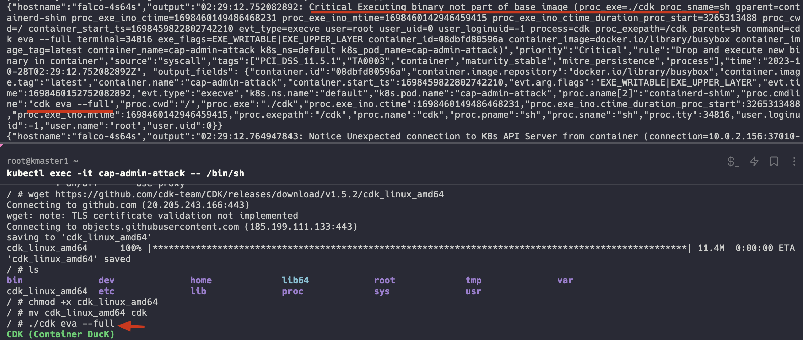
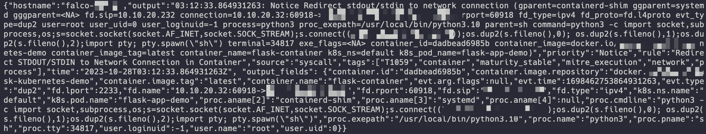
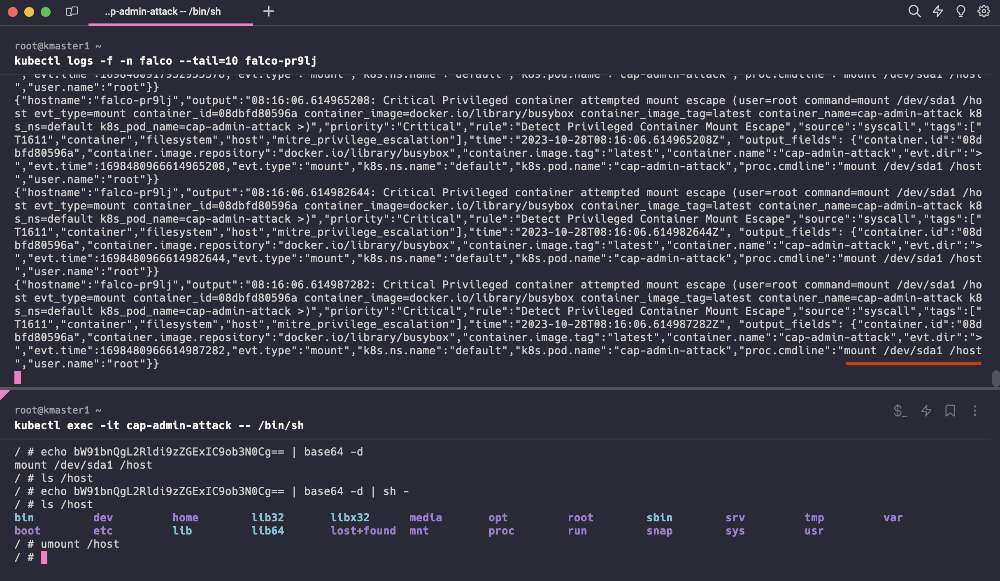

# 云原生安全资讯: 通过 Falco 检测 K8S 容器逃逸行为

## 1. 简介

[Falco (CNCF孵化项目)](https://github.com/falcosecurity/falco) 是一款适用于 Linux 操作系统的云原生运行时安全工具，旨在实时检测异常行为和潜在安全威胁并发出警报。该工具无需在容器内安装agent，而是通过 eBPF 探针有收集容器行为。

下面以攻击者发现一个具有 `CAP_SYS_ADMIN` 权限的容器RCE漏洞为例，介绍 Falco 容器逃逸行为检测

## 2. Falco 默认检测行为

攻击者通过 `cat /proc/1/cgroup` 发现是容器环境，通过 [cdk](https://github.com/cdk-team/CDK) 收集容器信息



运行 cdk 后，由于 cdk 不属于镜像原有的二进制文件，便触发 [Drop and execute new binary in container](https://github.com/falcosecurity/rules/blob/falco-rules-2.0.0/rules/falco_rules.yaml#L1171) 规则告警

```yaml
- rule: Drop and execute new binary in container
....
  condition: >
    spawned_process
    and container
    and proc.is_exe_upper_layer=true 
    and not container.image.repository in (known_drop_and_execute_containers)
....
```

再者，攻击者通过 `nc` 或 `python` 等工具进行反弹 shell 时，会触发规则

[Netcat Remote Code Execution in Container](https://github.com/falcosecurity/rules/blob/falco-rules-2.0.0/rules/falco_rules.yaml#L842-L860) 或

```yaml
....
  condition: >
    spawned_process 
    and container 
    and ((proc.name = "nc" and (proc.cmdline contains " -e" or 
                                proc.cmdline contains " -c")) or
         (proc.name = "ncat" and (proc.args contains "--sh-exec" or 
                                  proc.args contains "--exec" or proc.args contains "-e " or
                                  proc.args contains "-c " or proc.args contains "--lua-exec"))
         )
....
```

[Redirect STDOUT/STDIN to Network Connection in Container](https://github.com/falcosecurity/rules/blob/falco-rules-2.0.0/rules/falco_rules.yaml#L1018-L1034)

```yaml
....
  condition: > 
    dup 
    and container 
    and evt.rawres in (0, 1, 2) 
    and fd.type in ("ipv4", "ipv6") 
    and not user_known_stand_streams_redirect_activities
....
```



攻击者获取到容器权限后进行后渗透时就能及时发现


回到 `CAP_SYS_ADMIN` 权限场景，攻击者可以选择利用镜像内置命令进行容器逃逸，当然 Falco 内置了我们常用的挂载cgroups子系统逃逸检测 [Detect release_agent File Container Escapes](https://github.com/falcosecurity/rules/blob/falco-rules-2.0.0/rules/falco_rules.yaml#L1066-L1079)，但 mount 宿主机磁盘逃逸并没有内置，我们自定义规则检测即可

## 3. 自定义 Falco rules

因我是通过 helm 安装的，下一份 [charts/falco/values.yaml](https://github.com/falcosecurity/charts/blob/master/charts/falco/values.yaml) 到本地，修改 `customRules:` 部分为

```yaml
customRules:
  custom-rules.yaml: |-
    - rule: Detect Privileged Container Mount Escape
      desc: Detects a privileged container attempting to escape a mount namespace.
      priority:
        CRITICAL
      condition: >
        container and
        evt.type = mount and evt.dir=> and
        (proc.args contains "/dev") and
        user.uid=0 and
        thread.cap_effective contains CAP_SYS_ADMIN
      output: "Privileged container attempted mount escape (user=%user.name command=%proc.cmdline evt_type=%evt.type %container.info %evt.dir)"
      tags: [host, container, filesystem, mitre_privilege_escalation, T1611]
```

然后应用即可，注意修改 `user:changeme` 为你自己的名字

```yaml
helm upgrade falco -n falco -f values.yaml --set driver.kind=ebpf --set tty=true falcosecurity/falco \
--set falcosidekick.enabled=true \
--set falcosidekick.config.slack.webhookurl=$(base64 --decode <<< "aHR0cHM6Ly9ob29rcy5zbGFjay5jb20vc2VydmljZXMvVDA0QUhTRktMTTgvQjA1SzA3NkgyNlMvV2ZHRGQ5MFFDcENwNnFzNmFKNkV0dEg4") \
--set falcosidekick.config.slack.minimumpriority=notice \
--set falcosidekick.config.customfields="user:changeme"
```

所写的 Falco 是劫持系统调用参数，尽管 shell 执行命令存在混淆，也一样可以识别到



## 4. K8S 安装 Falco 和排障

> K8S版本：v1.27.3
>
> Linux内核版本：Linux kmaster1 5.15.0-84-generic #93-Ubuntu SMP Tue Sep 5 17:16:10 UTC 2023 x86_64 x86_64 x86_64 GNU/Linux

添加 Falco Helm 仓库 和 创建 Falco 服务命名空间

```bash
helm repo add falcosecurity https://falcosecurity.github.io/charts
helm repo update
kubectl create namespace falco
```

安装 Falco 和 Falcosidekick，注意修改 `user:changeme` 为你自己的名字

```bash
helm install falco -n falco --set driver.kind=ebpf --set tty=true falcosecurity/falco \
--set falcosidekick.enabled=true \
--set falcosidekick.config.slack.webhookurl=$(base64 --decode <<< "aHR0cHM6Ly9ob29rcy5zbGFjay5jb20vc2VydmljZXMvVDA0QUhTRktMTTgvQjA1SzA3NkgyNlMvV2ZHRGQ5MFFDcENwNnFzNmFKNkV0dEg4") \
--set falcosidekick.config.slack.minimumpriority=notice \
--set falcosidekick.config.customfields="user:changeme"
```

执行，查看安装进展，发现有个 pod 起不来

```bash
span
```

排障

```bash
kubectl logs -f -n falco falco-4s64s

.....
failed to create fsnotify watcher: too many open files
```

发现为内核配置问题，各个 K8S 节点执行

```bash
echo fs.inotify.max_user_instances=81920 >> /etc/sysctl.conf &&  sysctl -p
```

过会就OK了

```bash
kubectl get pods -n falco -w
NAME                                   READY   STATUS    RESTARTS         AGE
falco-4s64s                            2/2     Running   14 (5m18s ago)   24m
falco-924x2                            2/2     Running   0                24m
falco-falcosidekick-75b5c67bb6-722b8   1/1     Running   0                24m
falco-falcosidekick-75b5c67bb6-lwp5w   1/1     Running   0                24m
falco-rpxq7                            2/2     Running   0                24m
```

## 总结
Falco 提供的容器运行时安全检测功能是十分强大的，除了直接的屏幕输出，还支持 HTTP/gRPC 推送，为基于 Falco 开发容器安全平台提高了很强的可拓展性

## 参考

[1] [Try Falco on Kubernetes | Falco](https://falco.org/docs/getting-started/falco-kubernetes-quickstart/)

[2] [Falco Playground (falcosecurity.github.io)](https://falcosecurity.github.io/falco-playground/)

[3] [How to detect the containers’ escape capabilities with Falco – Sysdig](https://sysdig.com/blog/container-escape-capabilities-falco-detection/)
