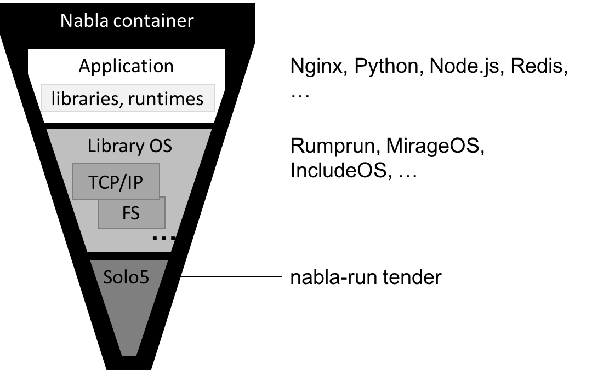
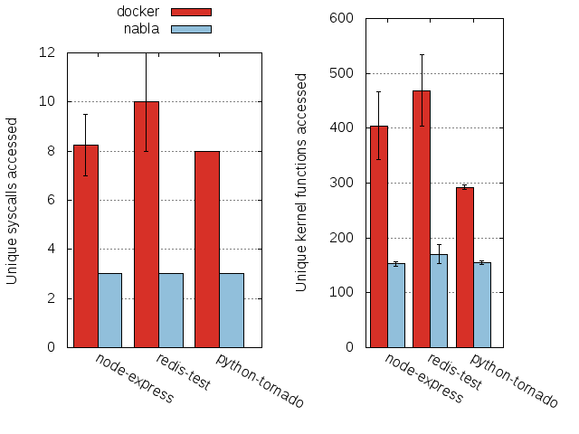

---

tags: Cloud Native Security News, nabla
version: v0.1.0

---

# Nabla Container

[Nabla容器](https://github.com/nabla-containers)通过采用减少对宿主机攻击面的策略来实现隔离。具体来说，Nabla容器利用库操作系统（Library OS，又称单核操作系统或[Unikernel](./2023-11-27_unikernel.md)）技术，主要是[Solo5项目](https://github.com/Solo5/solo5)的技术，来避免执行Linux系统调用，从而减少攻击面。Nabla容器仅使用7种系统调用，其他所有调用都通过Linux的seccomp策略被阻止。这些允许的系统调用包括：read、write、exit_group、clock_gettime、ppoll、pwrite64和pread64。它们仅限于特定的文件描述符（在启用seccomp之前已经打开）。这些系统调用源自ukvm单核操作系统监控器的超级调用实现。

至于Nabla容器是否真的加强了隔离的问题，在于它通过阻止系统调用来限制对宿主内核的访问。作者测量了在Nabla容器和标准容器中常见应用程序对内核的访问量，包括容器化应用程序所做的系统调用数量以及它们所访问的内核功能数量。

局限性：
+ Nabla 运行时(runnc)只支持为 Nabla 构建的镜像(参见 [Nabla-base-build](https://github.com/nabla-containers/nabla-base-build))
+ 无法正确处理 /32 IP地址分配。当前的解决方案是将cidr从32转换为1。

作者目前正在努力解决的一些缺失特性（遗憾的是，目前项目已经 archive 了）：
+ MirageOS和IncludeOS基础镜像
+ rumprun（来自rumprun-packages）上所有已知应用的基础镜像，如openjdk。
+ 可写的文件系统。目前只有/tmp是可写的。
+ 支持提交镜像
+ 卷（如docker -v /a:/a）
+ 不忽略cgroups（从内存相关的开始）
+ 多个网络接口
+ runnc对交互式控制台/tty的使用（例如docker run -it）

以下是一些作者认为更难实现的特性（按重要性排序）：
+ 允许动态加载库。Nabla运行时只能启动静态二进制文件，这似乎对大多数事情来说都可以，但一个很大的限制是python无法加载带有.so的模块。
+ 使用除rumprun netbsd libc之外的其他内容：可以使用LKL，或者IncludeOS最近对musl libc的支持，或者在类似glibc的东西上封装netbsd libc
+ mmap()，用于共享内存到/从另一个进程（nabla和非nabla）
+ GPU支持
+ 对自定义/主机命名空间的支持
+ docker exec。它会运行什么？使用者会在里面做什么（例如仅包含一个静态构建的go二进制文件的镜像）
+ "真正的" TLS（线程局部存储）支持。目前，基于pthread-key的线程特定数据被支持（pthread_key_create / pthread_setspecific），但它不使用真正的基于段的TLS。所以你会得到正确的行为，但不是最佳性能的实现。另外，__thread不被支持。

作者不知道如何修复（也不知道是否应该修复）的更难问题：
+ 支持运行普通镜像。目前Nabla只能运行基于Nabla的镜像。
+ fork()。一个Nabla进程是否应该fork另一个Nabla进程（单核操作系统）？一个单核操作系统不能运行多个地址空间。

## 参考
[1] https://nabla-containers.github.io/

----

本文发布已获得"云原生安全资讯"项目授权, 同步发布于以下平台

* github: [https://github.com/cloud-native-security-news/cloud-native-security-news](https://github.com/cloud-native-security-news/cloud-native-security-news)

欢迎加入 "云原生安全资讯"项目 👏 阅读、学习和总结云原生安全相关资讯