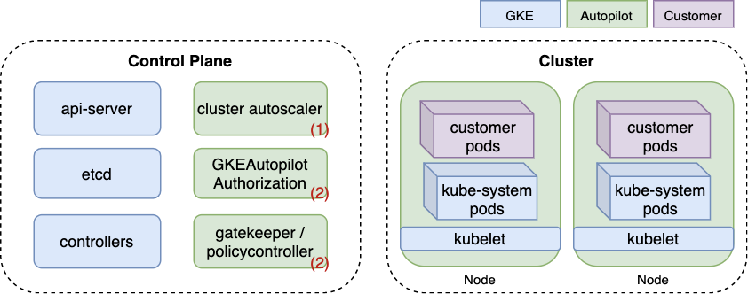

---

tags: Cloud Native Security News,云漏洞案例
spec version: v0.1.3
version: v0.1.0
author: tari

---

# 1. 云漏洞案例 | Unit42: GKE Autopilot 从容器逃逸到接管k8s集群并持久化后门

> 原文地址: https://unit42.paloaltonetworks.com/gke-autopilot-vulnerabilities/

## 1.1 简介
2021年6月，Unit42 安全研究员 Yuval Avrahami 披露了 GKE Autopilot 的严重漏洞

1. 容器逃逸至Node节点
2. 提权至k8s管理员
3. 持久化并使得k8s集群管理员无法发现

只要攻击者获取到了一个 Autopilot 的开发者账号，就能拿下整个k8s集群

## 1.2 Autopilot介绍

2021年2月，谷歌发布了一种新的 GKE 操作模式：[Autopilot](https://cloud.google.com/blog/products/containers-kubernetes/introducing-gke-autopilot)

在 GKE 标准模式中，客户需要管理自己的集群基础设施，并按节点付费。使用 GKE Autopilot，谷歌会负责集群基础设施的管理，客户只需为其运行的 Pods 付费。这使得客户可以集中精力在他们的应用程序上，从而减少运营成本。

图1 *GKE Autopilot 架构*

如图1所示，两个组件执行 Autopilot 的策略。第一个是 [OPA Gatekeeper](https://github.com/open-policy-agent/gatekeeper) 验证准入 Webhook，这是一个广泛用于 Kubernetes policy 执行的开源项目。第二个是一个名为 GKEAutopilot 的专有 Kubernetes 授权模式，谷歌通过修改 Kubernetes 源代码来实现它。

内置的policy 有两个目的：

1. 防止用户访问谷歌管理的集群组件，如节点；
2. 维护安全的 Kubernetes 最佳实践，如 Autopilot 禁止运行特权容器

图2 *Autopilot 的内置 policy 会阻止特权容器逃逸 (Gatekeeper)*

除了防御容器逃逸，还有一些其他的限制

图3 限制访问 kube-system 命名空间

图4 用户不能查看和创建 mutate 准入 webhook

图5 External IP svc 由于 CVE-2020-8554 被禁用

图2和5是由Gatekeeper作用，图3和4是由GKE Autopilot 授权模式作用

可以看到，其实用户的 Autopilot 是受限的，比如无法访问 kube-system 命名空间，如果能绕过 Autopilot 的安全策略，就可以创建一个对用户来说不可见的持久化后门

## 1.3 容器逃逸至Node节点

Autopilot 集群有一个比较有意思的 CRD `allowlistedworkloads` 

在图2所示，Autopilot 禁止可能允许容器逃逸的 pod 配置。为了支持需要某种节点访问级别的插件，Autopilot 创建了一个 `allow-listed` 工作负载的概念。如果容器匹配 `allow-listed` 的工作负载，它被允许使用在 `allow-listed` 工作负载配置中指定的特权功能。2021年6月时只有 Datadog agents。

下面是 Datadog agents  `allow-listed`  的工作负载配置。如果一个容器的 spec command 部分使用 `bash -c` 和 image  满足 `gcr.io/datadoghq/agent*` ，它允许以只读卷的形式挂载 `/proc` 和 `/var/run/containerd` 宿主机路径。

但这个校验不充分，例如使用下面配置即可执行任意命令 

在下面的视频中，一个恶意用户部署了一个伪装成 Datadog 代理的 pod。该 pod 通过以下步骤接管其宿主机节点：

1. 滥用挂载的 containerd 套接字来创建一个挂载宿主文件系统的特权容器。
2. 让该特权容器安装一个 systemd 服务，该服务可以让节点反弹 shell 到攻击者控制的机器。

漏洞演示：[GKE Autopilot - Pod Masquerading as Datadog Agent](https://youtu.be/0cZJklJxTQk)

在 Autopilot 服务中可以创建 pod 的攻击者可以利用此漏洞进入到node，造成以下影响：

1. 由于 Autopilot 管理员无法访问节点，攻击者可能会滥用这一问题在节点上安装隐蔽的恶意软件或加密货币挖矿程序。不过Autopilot 会自动扩容和缩容节点，因此确保恶意软件持续存在并不简单。
2. 攻击者获得对底层 Kubelet 凭据的访问，几乎可以查看所有集群对象。
3. 由于 Autopilot 仅按运行中的 pod 收费，一些用户可能已经滥用这一问题来减少一些成本，直接在节点上运行某些工作负载。

## 1.4 Node节点提权至k8s集群管理员

Autopilot 完全移除了对 kube-system 的 serviceaccount 的限制, 因此被窃取的kube-system serviceaccount token 可以放心使用，不用担心上文提到的策略限制。

文章用到了 [sa-hunter](https://github.com/twistlock/sa-hunter)（现合入 https://github.com/PaloAltoNetworks/rbac-police ）可以方便查看 pod 的 sa 权限信息

发现 `stackdriver-metadata-agent-cluster-level` 和 `metrics-server` 这两个 kube-system 的默认 pod 有更新 deployment 的权限

这种权限乍一看似乎无害，但它足以升级到完整的集群管理员权限。有趣的是，这些 pod 在 GKE Standard 中也是默认部署的，这使得以下的权限提升技术对所有 GKE 集群（标准和Autopilot）都有效。

只要更新 deployment 的 sa 为高权限 sa 即可，即可在 `/run/secrets/kubernetes.io/serviceaccount/token` 目录拿到 token

可以挂载 `clusterrole-aggregation-controller` (CRAC) sa，因为他可以为已存在的 cluster role 增加任意权限

基于前面容器逃逸基础上利用，我们只需要把恶意pod部署在存在 `stackdriver-metadata-agent-cluster-level` 或 `metrics-server` pod 的节点上。虽然 Autopilot 会禁止部署带有 `nodeSelectors` 的pod，不过它允许最简单形式的节点指派方式 —— [nodeName](https://kubernetes.io/docs/concepts/scheduling-eviction/assign-pod-node/#nodename) 字段 （只要目标节点有足够资源容纳该pod，pod就会调度到该节点上）

## 1.5 后门webhook

既然是通过 webhook 限制权限，那么也可以加个 webhook，特定请求不限制权限，这里通过创建 [mutating admission webhooks](https://kubernetes.io/docs/reference/access-authn-authz/admission-controllers/#mutatingadmissionwebhook) 可以做到监听（篡改）任意 k8s 的创建和修改操作，

整条攻击链演示: [GKE Autopilot - Unrestricted Administrator and Invisible Backdoor](https://www.youtube.com/watch?v=4Dddhk1QclY)

## 1.6 其他问题

1. 默认命名空间 `csi-attacher` 和 `otelsvc` 的 sa 也被 Autopilot policy 放到白名单中，如果攻击者能拿到默认命名空间权限，就可以利用这两个 sa 进行上述操作接管集群
2. 利用 CVE-2020-8554 通过 Load Balancer 服务攻击节点，但是需要管理员特权才能利用。这里的攻击场景是攻击者已经拿下了 Autopilot 集群，并且正在寻找绕过内置策略来建立一个隐蔽的后门。

## 1.7 修复和改进

1. 集群管理员现在可以列出、查看，甚至创建变更准入 Webhooks，防止它们被滥用作为隐形后门；
2. 谷歌加强了白名单工作负载（`allowlistedworkloads`）的验证过程；
3. policy 执行从 OPA Gatekeeper 转移到了谷歌的policy控制器，允许客户部署他们自己的 Gatekeeper 实例。客户现在可以在内置policy之上执行他们自己的策略。作为深层防御和为了缓解可能的未来问题，建议和 GKE 标准环境中的相同策略保持一致；
4. 内置 policy 不再可见，防止被研究绕过；
5. `csi-attacher` 和 `otelsvc` 服务账户不再免除Autopilot 的policy ；
6. 谷歌[开源了一个 OPA Gatekeeper 策略](https://www.notion.so/Prometheus-61fb4c533e274513951725597b51c305?pvs=21)，该策略限制了在攻击中被滥用的 kube-system pods。该策略阻止这些 pods 将新的服务账户分配给现有的 pod。更多信息请参见 [GKE 的加固指南](https://cloud.google.com/kubernetes-engine/docs/how-to/hardening-your-cluster#restrict_self_modify)。

## 1.8 缓解此类漏洞

在生产环境这些pod管理起来挺复杂的，特别是有业务需求的时候，可以从下面几点着手：

1. 尽可能去掉不必要sa权限，或者把pod放到特定的命名空间和资源名称中；
2. 如果pod是外部解决方案的一部分，联系云提供商或者项目裁剪掉不必要权限。如果pod用来管理k8s服务，应该把它作为控制面控制器；
3. 通过 OPA Gatekeeper 去限制和监测 pod 的危险操作，因为 k8s 权限多且泛，分配合理的 pod 权限比较难控制，但一般 pod 业务上是不会执行一些较敏感或危险操作的。
4. 使用 [Taints](https://kubernetes.io/docs/concepts/scheduling-eviction/taint-and-toleration/)、 [NodeAffinity](https://kubernetes.io/docs/concepts/scheduling-eviction/assign-pod-node/#affinity-and-anti-affinity) 或 [PodAntiAffinity](https://kubernetes.io/docs/concepts/scheduling-eviction/assign-pod-node/#affinity-and-anti-affinity) 规则将高权限 pods 与不可信或公开的 pods 隔离开来，确保它们不在同一个节点上运行。

## 1.9 总结
yuval 提出的 GKE Autopilot 服务特有的攻击面很好，类似的 托管 k8s 服务都存在类似的攻击面：

1. 集群管理员依赖 云厂商 的策略来防止有风险的配置，该策略可能绕过
2. 集群管理员并没有集群的完全控制权限，如果攻击者可以获得比管理员更高的权限，可进行更隐蔽的持久化和权限维持
3. 类似的托管 k8s 服务仅按运行中的 pod 收费，一些用户可能逃逸到节点上直接运行某些工作负载来躲避收费