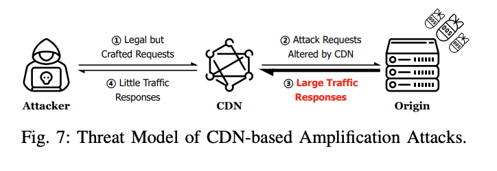

---

tags: Cloud Native Security News, Paper, ndss
version: v0.1.0

---

> 论文地址：https://www.ndss-symposium.org/wp-content/uploads/2024-31-paper.pdf

# CDN 转发请求不一致导致的 DoS 攻击

## 0x01 论文介绍

论文提出了一种名为 ReqsMiner fuzz 方法：使用基于语法的模糊测试自动发现 CDN 转发请求不一致和 DoS 攻击

研究成果：针对全球22个CDN厂商发现3个新和74个潜在HTTP放大型攻击，平均能放大2000倍流量，在特定条件下能达 1,920,000 倍

这里的放大系数（倍数）是指：
```
(CDN ← 回源服务器) / (client ← CDN)
```

- 分子：回源服务器给 CDN 的回包流量
- 分母：CDN给客户端的回包流量

论文行文思路：介绍、背景、Fuzz框架设计和实现、实验和发现、HTTP放大型DoS攻击、讨论（限制/根因和缓解/披露）、相关工作、总结。**本文主要总结下攻击方式，不涉及Fuzz**。

## 0x02 一些差异化发现

攻击方式主要是利用特定的HTTP请求包，使得CDN回源的回包流量大于CDN对攻击者的回包流量，从而达到攻击者通过在CDN更小的回包流量 放大 服务端更大的回包流量，从而达到 HTTP 放大型 DoS 攻击目的



文中发现改变HTTP报文的一些值（具体文中根据 HTTP RFC 定义并进行fuzz得出）会导致【攻击者-CDN-源服务器】三者请求和回包不一致：

1. Request Line，根据 [RFC9112](https://www.rfc-editor.org/info/rfc9112) 定义：
- **HTTP 请求方法：** 有 11个CDN厂商会把`HEAD`请求转换为`GET`请求，并在接收回源服务器的响应体时，把响应体去掉在返回给用户（CDN为了遵守RFC的HEAD 请求规范 ）。攻击者可以利用这点，通过发送一个小流量的HTTP `HEAD` 请求，导致服务端消耗了更多的出口带宽，攻击者也不需要消耗多余的流量来接收响应。此外阿里云和七牛云会改变一些特殊的请求方式（如 LOCK MERGE MKACTIVITY）为GET请求，不过源服务器回包的，CDN会把回包直接返回给攻击者
- **请求路径：** 有6个厂商会删掉URL `#` 后面的内容，这没啥大问题，因为它主要用作锚点（当前也有利用这点用来进行攻击的）。Akamai 厂商会把2个 `/` 合并为1个。Azure 和 BunnyCDN 则会把 `/./` 和 `/dir/../` 去掉再回源。
- **HTTP版本：** 阿里、七牛云和腾讯云只允许1.0和1.1.其他则允许1.0-1.9，Verizon还允许0.9，Akamai和StackPath甚至允许0.0-9.9。CDN厂商在转发请求时一般会把HTTP版本转为1.1，但Verizon会把0.9/1.0转换为1.0，StackPath会把0.0-0.9转换为0.9。论文作者认为转为0.9和1.0版本不太合适，因为这两个版本都deprecated了。这样改可能会有个问题，就是源服务器不支持这个版本的话，源服务器会返回400/505，如果CDN缓存了就会导致 [CPDoS 攻击](https://www.anquanke.com/post/id/189507)。
1. HTTP 请求头
- **重复请求头解析差异**，如 Host和Content-Length。BunnyCDN会把重复的字段合并，以`;`而不是遵循RFC标准以`,`分隔，如果源服务器不支持以`;`分隔解析，那么可能会报`4xx/5xx`错并可能导致CPDoS。对于重复的`Host`字段，大多数CDN厂商会只保留第1个，除了6个CDN厂商会以400/500状态码拒绝请求，特别地谷歌云会用`,`号分隔`Host`头拼接起来，这是违反了RFC规范的。对于重复的`Content-Length`（CL）字段，除了阿里云会保留第1个转发，腾讯云则保留最后1个转发，其余都是通过400状态码拒绝请求。
- **厂商特有头部**，比如 [CDN-Loop 或 Via 字段 防止循环转发攻击](https://www.icir.org/vern/papers/cdn-loops.NDSS16.pdf)（只有CDNetworks、ChinaNetCenter、Cloudflare、Fastly和Gcore有防止这种攻击），还有 cf 的一些特性头 CF-Connecting-IP、CF-IPCountry、CF-RAY、CF-Visitor。
- **一些头部会被 CDN 去掉**，如 TE、Upgrade、Range，这个会在第2种新的HTTP放大型DoS攻击中详细讨论。先前的也有研究了去掉Range头导致的[RangeAmp攻击](https://ieeexplore.ieee.org/document/9153355)
- **更改一些头部的值，如 Accept-Language、Accept-Encoding**。`Accept-Language`主要是为了用户体验，比如用户头部带着不同语言，服务端即可用来识别返回相应语言。此外，有15个CDN厂商更改了Accept-Encoding头，这会导致下面说的第3种新的HTTP放大型DoS攻击
1. HTTP 请求体
- **RFC 7231 没有定义 GET/HEAD 请求体**，Akamai和Azure会把GET/HEAD请求体去掉，其他则直接返回4xx/5xx响应给用户，这可能导致CPDoS攻击。
- **Transfer Encoding 字段，如 chunked**。阿里云、CDN77、Cloudflare和Gcore会把所有分快传输合为一个请求发给源站，并改变 `Transfer-Encoding` 字段，这会导致[Slowloris-like攻击](https://www.cloudflare-cn.com/learning/ddos/ddos-attack-tools/slowloris/) 和 [脉冲（Pulse Wave）DoS攻击](https://ddos-guard.net/en/terms/ddos-attack-types/pulse-wave-ddos-attack)

## 0x03 3种新的HTTP放大型DoS攻击

> 所研究的22个CDN云厂商默认CDN配置可利用，并没有手工启用DoS防护选项
> 
### 1. HEAD Request-based HTTP Amplification Attack

攻击利用前提是该静态资源还没被CDN缓存，或者是缓存已到期


这里就是利用HTTP请求方法，在发送 HEAD 请求类型时，CDN 会把请求自动转换为 GET 请求回源，这时源服务器正常返回图片信息，但CDN并不会把图片信息返回给攻击者，这样攻击者利用小量的带宽消耗了源服务器的大量带宽。

下面是论文给的表格和图


也就是说，当源服务器的资源大小为1MB时在不同的CDN厂商的作用下，回源服务器需要返回响应流量的放大系数为：137.52（Aliyun）、56.70（Azure）、1119.00（BunnyCDN）、23.79（CDN77）、1595.73（CDNetworks）、….


### 2. Conditional Request-based HTTP Amplification Attack

攻击利用前提是该静态资源还没被CDN缓存，或者是缓存已到期

> If-Match、If-None-Match、If-Modified-Since、If-Unmodified-Since、If-Range 和 Range
> 


攻击者发出的几个HTTP请求为条件请求，但CDN发现相应的值与CDN的不匹配时（这个很容易做到，例如 `If-Match: 随机uuid4值` 几乎不会和服务端端 `ETag` 撞上），CDN回返回相应的异常状态码如 `412`（Precondition Failed ）然后响应body为空。由于CDN发送请求给回源服务器时相关头部会被去掉，回源服务器的响应body也是正常内容。

和第一个 HEAD 攻击类似：回源服务器正常返回图片信息，但CDN并不会把图片信息返回给攻击者，这样攻击者利用小量的带宽消耗了源服务器的大量带宽。


上图是16个CDN厂商在不同HTTP头影响下的放大系数，其中 `If-None-Match` 的放大系数更为明显

### 3.  Accept-Encoding-based HTTP Amplification Attack


gzip头是客户端和服务端协商压缩算法，导致CDN发给攻击者的响应内容会被压缩，但由于CDN会去掉这个请求头回源，回源服务器发给CDN的响应内容不会被压缩，从而导致攻击者利用小量的带宽消耗了源服务器更大的带宽。


表三表明来4个CDN厂商在该攻击下的放大系数，图12表明不同静态资源对放大系数的影响

当然该攻击和目标站的静态资源的压缩率有关，如果目标站上传的文件内容可控，比如上传一个文件内容全是 \x00 或者全是一样字符的文件， 这样的放大系数会更高。

## 0x04 总结


在研究的22个CDN厂商中，有19个厂商受到不同种类攻击手法的影响，影响很是很广泛的，而且造成DoS攻击的成本由于放大系数的影响也不用专门花费大量成本构造一个DDoS攻击网络去攻击，就能造成CDN用户大量的带宽（经济）损失