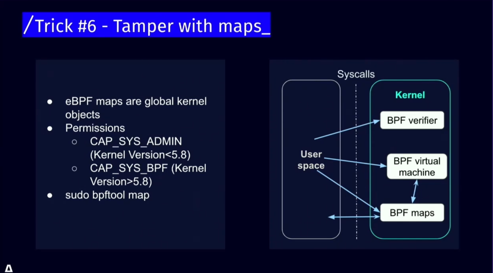

---

tags: 云原生安全资讯,安全会议,k8s,躲避防御
author: noirfate
spec: v0.1.1
version: v0.1.0

---

# [Cloud Native SecurityCon North America 2024] Evasive Maneuvers：Strategies to Overcome Runtime Detection Tools

| Item            | Content        | Note     |
|-----------------|----------------|----------|
| Talk Name   | Evasive Maneuvers：Strategies to Overcome Runtime Detection Tools |
| Conference Name | Cloud Native SecurityCon North America 2024 |
| Talker          |  Amit Schendel  |
| Date            | 2024-06-26 |
| Materials       | [schedule](https://cloudnativesecurityconna24.sched.com/event/1dCUy/evasive-maneuvers-strategies-to-overcome-runtime-detection-tools-amit-schendel-armo)   |
|                 | [video](https://www.youtube.com/watch?v=o-ekL-QE2GY&list=PLj6h78yzYM2MSAFvjG22ZynvaUs1nnaQJ&index=1&pp=iAQB)      |

## 1. What
本演讲的主旨为介绍一些绕过云原生环境中监控工具的方法技巧

## 2. Situation
### 常见监控目标
- 进程（Process）
- 系统调用（System Call）
- 网络（Networking）
- 权限（Capability）
- 文件（File）
- 其他（Others）
### 常见开源监控工具
- Kubescape
- Falco
- Tetragon
- Tracee
- Others

## 3. How
### 符号链接
如果没用监控符号链接，则可以通过创建/读取符号链接的方式绕过文件检测
```
ln -s /etc/passwd /tmp/.123.tmp
cat /tmp/.123.tmp
```
### io_uring
通过使用io_uring绕过对io系统调用的监控，下图中可以看到`tetragon`没有监测到`/home/ubuntu/playground/play`读取`/etc/passwd`的操作
```
struct io_uring ring;
struct io_uring_sqe *sqe;
struct io_uring_cqe *cqe;

io_uring_queue_init(8, &ring, 0);
sqe = io_uring_get_sqe(&ring);
io_uring_prep_symlinkat(sqe, "/etc/passwd", 0, "/tmp/.a");
io_uring_submit(&ring);
io_uring_wait_cqe(&ring, &cqe);
io_uring_cqe_seen(&ring, cqe);
io_uring_queue_exit(&ring);
```

### 不使用`syscall`

### 修改监控进程的`ebpf maps`
如[ebpf-attacks](https://github.com/Vali-Cyber/ebpf-attacks)

### 耗尽`ebpf maps`存储资源

### TOCTOU
由于`ebpf`的钩子在系统调用入口，检查的用户数据和内核实际使用的用户数据可能不同，即在检查后、使用前这段时间内攻击者更改了数据，从而造成TOCTOU，绕过监测

### 使用镜像内预装的工具

