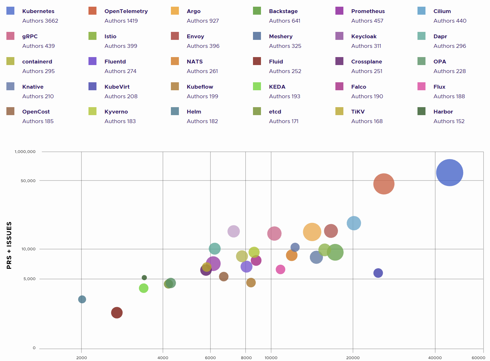

---

tags: 云原生安全资讯,安全会议,CNCF,K8S
author: noirfate
spec: v0.1.1
version: v0.1.0

---

# [CloudNativeCon North America 2024]: From Risks to Resilience: Leveraging CNCF Projects Against Kubernetes' OWASP Top 10

| Item            | Content        | Note     |
|-----------------|----------------|----------|
| Talk Name   | From Risks to Resilience: Leveraging CNCF Projects Against Kubernetes' OWASP Top 10 |
| Conference Name | CloudNativeCon North America 2024 |
| Talker          |  Hilliary Lipsig & Alireza Rahmani  |
| Date            | 2024-06-27 |
| Materials       | [schedule](https://cloudnativesecurityconna24.sched.com/event/1dCW5/from-risks-to-resilience-leveraging-cncf-projects-against-kubernetes-owasp-top-10-alireza-rahmani-hilliary-lipsig-red-hat)   |
|                 | [video](https://www.youtube.com/watch?v=03SgRDQbq10&list=PLj6h78yzYM2MSAFvjG22ZynvaUs1nnaQJ&index=78&pp=iAQB)      |
|                 | [slide](https://static.sched.com/hosted_files/cloudnativesecurityconna24/cc/From%20Risks%20to%20Resilience_%20Leveraging%20CNCF%20Projects%20Against%20Kubernetes%27%20OWASP%20Top%2010.pdf)      |

## 1. What
本演讲从OWASP总结的Kubernetes上的Top 10风险入手，介绍可以应对这些风险的CNCF开源项目

## 2. Situation
[CNCF 2023年度报告](https://www.cncf.io/reports/cncf-annual-report-2023/)中总结的年度高成长组件`Top 30`

## 3. How
### [K01: Insecure Workload Configurations](https://owasp.org/www-project-kubernetes-top-ten/2022/en/src/K01-insecure-workload-configurations)
#### 安全配置建议
- 不以root运行
- 使用只读根文件系统
- 不使用特权容器
- 使用资源限制
- 不允许提权
#### CNCF相关项目
- [Kyverno](https://github.com/kyverno/kyverno)
CNCF孵化项目，是一个为云原生平台工程团队设计的策略引擎。它通过策略即代码实现安全性、自动化、合规性和治理
- [Falco](https://github.com/falcosecurity/falco)
CNCF毕业项目，是一个针对Linux操作系统的云原生运行时的安全工具。旨在实时检测和警报异常行为和潜在安全威胁
- [OPA](https://github.com/open-policy-agent/opa)
CNCF毕业项目，是一个开源的通用策略引擎，能够在整个技术栈中实现统一的、上下文感知的策略执行
- [Kubescape](https://github.com/kubescape/kubescape)
CNCF沙盒项目，是一个开源的Kubernetes安全平台，提供从左到右覆盖整个开发和部署生命周期的全面安全保障。它提供加固、态势管理和运行时安全功能，以确保对Kubernetes环境的强大保护
- [Kubewarden](https://github.com/kubewarden)
CNCF沙盒项目，是一个Kubernetes的策略引擎，以帮助保持您的Kubernetes集群安全和合规。Kubewarden策略可以使用常规编程语言或DSL编写。策略被编译成WebAssembly模块，然后通过传统的容器注册表进行分发

### [K02: Supply Chain Vulnerabilities](https://owasp.org/www-project-kubernetes-top-ten/2022/en/src/K02-supply-chain-vulnerabilities)
#### 安全配置建议
- 镜像完整性校验
- 使用SBOM
- 使用镜像签名
- 使用最小化镜像
- 镜像漏洞扫描
#### CNCF相关项目
- Kyverno
- Falco
- OPA
- [TUF](https://github.com/theupdateframework/python-tuf)
CNCF毕业项目，是一个安全更新软件包的框架，它旨在帮助开发人员保护软件更新过程，防止各种攻击（如中间人攻击、回滚攻击等）。TUF提供了一套标准的、可验证的机制来确保软件包的完整性和来源的真实性
- [Harbor](https://github.com/goharbor/harbor)
CNCF毕业项目，是一个开源的可信云原生仓库项目，用于存储、签名和扫描镜像
- [in-toto](https://github.com/in-toto/in-toto)
CNCF孵化项目，提供了一个框架，以保护软件供应链的完整性。它通过验证链中的每个任务是否按计划执行、仅由授权人员进行，以及产品在运输过程中未被篡改来实现这一目标

### [K03: Overly Permissive RBAC Configurations](https://owasp.org/www-project-kubernetes-top-ten/2022/en/src/K03-overly-permissive-rbac)
#### 安全配置建议
- 尽可能减少最终用户对集群的直接访问
- 不要在集群外使用`Service Account Token`
- 避免自动挂载默认`Service Account Token`
- 审计与已安装的第三方组件的RBAC配置
- 部署中心化的策略管理以检测和阻止风险RBAC权限
- 利用`Rolebindings`将权限范围限制在特定命名空间，而不是`cluster-wide`RBAC政策
- 遵循Kubernetes官方[RBAC最佳实践](https://kubernetes.io/docs/concepts/security/rbac-good-practices/)
- 遵循最小权限原则
#### CNCF相关项目
- Kyverno
- Falco
- OPA
- [Keycloak](https://github.com/keycloak/keycloak)
CNCF孵化项目，为应用程序添加身份验证并以最小的努力保护服务，提供用户联邦认证、强身份验证、用户管理、细粒度授权等功能

### [K04: Lack of Centralized Policy Enforcement](https://owasp.org/www-project-kubernetes-top-ten/2022/en/src/K04-policy-enforcement)
#### 安全配置建议
- 定义清晰的策略
- 禁止未授权访问
- 持续审计和监控
- 持续改进
#### CNCF相关项目
- Kyverno
- Falco
- OPA
- [argo](https://github.com/argoproj/argo-cd)
CNCF毕业项目，用于Kubernetes的声明式的、GitOps持续集成部署工具
- [flux](https://github.com/fluxcd/flux2)
CNCF毕业项目，用于保持Kubernetes集群与配置源（如 Git 仓库和OCI组件）同步的工具，并在有新代码要部署时自动更新配置

### [K05: Inadequate Logging and Monitoring](https://owasp.org/www-project-kubernetes-top-ten/2022/en/src/K05-inadequate-logging)
#### 安全配置建议
- 开启详细日志
- 集中化日志管理
- 日志轮转
- 对日志进行监控和分析
- 开启审计日志
- 使用日志工具
#### CNCF相关项目
- [OpenTelemetry](https://github.com/open-telemetry)
CNCF孵化项目，用于软件的性能和行为进行仪表化、生成、收集和导出遥测数据（指标、日志和追踪），以帮助您分析软件的性能和行为
- [Prometheus](https://github.com/prometheus/prometheus)
CNCF毕业项目，用于监控系统和服务，以设定的时间间隔从配置的目标收集监控指标，利用规则表达式进行评估并显示结果，满足指定条件时触发警报
- [Jaeger](https://github.com/jaegertracing/jaeger)
CNCF毕业项目，分布式全链路追踪平台
- [cortex](https://github.com/cortexproject/cortex)
CNCF孵化项目，是一个水平可扩展、高可用性、多租户的 Prometheus 长期存储解决方案

### [K06: Broken Authentication Mechanisms](https://owasp.org/www-project-kubernetes-top-ten/2022/en/src/K06-broken-authentication)
#### 安全配置建议
- 避免在最终用户侧使用证书访问集群
- 开启MFA
- 不要在集群外使用`Service Account Token`
- 使用RBAC进行权限配置管理
#### CNCF相关项目
- Falco
- Keycloak
- [cert manager](https://github.com/cert-manager/cert-manager)
CNCF毕业项目，为k8s集群提供证书管理功能，可以颁发/吊销证书，支撑微服务间的mTLS双向认证

### [K07: Missing Network Segmentation Controls](https://owasp.org/www-project-kubernetes-top-ten/2022/en/src/K07-network-segmentation)
#### 安全配置建议
- 使用`Network Policies`
- 使用`Service Meshes`
- 部署多集群
- 使用CNI插件
#### CNCF相关项目
- [istio](https://github.com/istio/istio)
CNCF毕业项目，开源服务网格，提供了一种统一且更高效的方式来保护、连接和监控服务
- [cilium](https://github.com/cilium/cilium)
CNCF毕业项目，是一个基于eBPF的，用于提供、保护和观察容器工作负载（云原生）之间网络连接的解决方案
- [linkerd](https://github.com/linkerd/linkerd2/)
CNCF毕业项目，是一个超轻量、以安全为首的Kubernetes服务网格

### [K08: Secrets Management Failures](https://owasp.org/www-project-kubernetes-top-ten/2022/en/src/K08-secrets-management)
#### 安全配置建议
- 使用RBAC限制对`secrets`的访问
- 加密存储`secrets`
- 对`secrets`访问进行审计
- 定期轮转`secrets`
#### CNCF相关项目
- cert manager
- [spire](https://github.com/spiffe/spire)
CNCF毕业项目，是SPIFFE统一身份认证标准的官方实现，为服务间通信提供安全的身份认证和加密通道，实现零信任网络

### [K09: Misconfigured Cluster Components](https://owasp.org/www-project-kubernetes-top-ten/2022/en/src/K09-misconfigured-cluster-components)
#### 安全配置建议
- 禁止匿名访问
- 配置强认证
- 限制网络访问
- 遵从安全配置实践
#### CNCF相关项目
- kyverno
- keycloak
- falco
- opa

### [K10: Outdated and Vulnerable Kubernetes Components](https://owasp.org/www-project-kubernetes-top-ten/2022/en/src/K10-vulnerable-components)
#### 安全配置建议
- 跟踪漏洞库
- 持续进行漏洞扫描
- 减少三方依赖
- 做好补丁管理
#### CNCF相关项目
- falco
- kubescape
- argo
- flux
