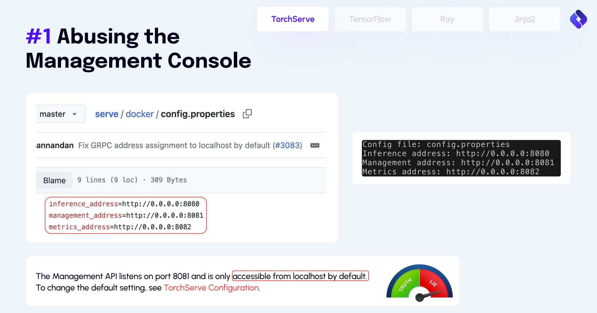

---

tags: 云原生安全资讯,安全会议,CNCF,AI
author: noirfate
spec: v0.1.1
version: v0.1.0

---

# [CloudNativeSecurityConNA2024] Shadow Vulnerabilities in AI/ML Data Stacks - What You Don’t Know Can Hurt You

| Item            | Content        | Note     |
|-----------------|----------------|----------|
| Talk Name   | Shadow Vulnerabilities in AI/ML Data Stacks - What You Don’t Know Can Hurt You |
| Conference Name | Cloud Native SecurityCon North America 2024 |
| Talker          |  Avi Lumelsky & Nitzan Mousseri  |
| Date            | 2024-06-26 |
| Materials       | [schedule](https://cloudnativesecurityconna24.sched.com/event/1dCTo/shadow-vulnerabilities-in-aiml-data-stacks-what-you-dont-know-can-hurt-you-avi-lumelsky-nitzan-mousseri-oligo-security)   |
|                 | [video](https://youtu.be/MxbWDj0qap8)      |
|                 | [slide](https://static.sched.com/hosted_files/cloudnativesecurityconna24/31/Shadow%20Vulnerabilities%20in%20AI.pdf)      |

## 1. What
本演讲讲述了那些`影子漏洞`对AI系统安全的影响，所谓影子漏洞即：
- 没有CVE，或者CVE的状态是`disputed`，有争议的
- 维护者往往知晓影子漏洞的存在，但认为它是功能或者是使用不善导致的
- 默认不安全配置
- 在文档中提示了风险，但无人注意

### SnakeYAML

## 2. Situation
### Pytorch
- 未授权访问

- 反序列化

### Keras
- lambda层可执行任意代码

- 构造恶意模型文件可导致代码执行

- 只针对新版模型文件进行修复，加载老版模型文件时依旧存在漏洞

- 影响到其他开源软件

### Ray
`ShadowRay`未授权访问漏洞

### LLaMA
- `Jinja2`模板注入

- `LLaMA`和`LiteLLM`由于引入了`Jinja2`，故存命令执行漏洞

## 3. How
使用`sandbox`和监控来防止影子漏洞

