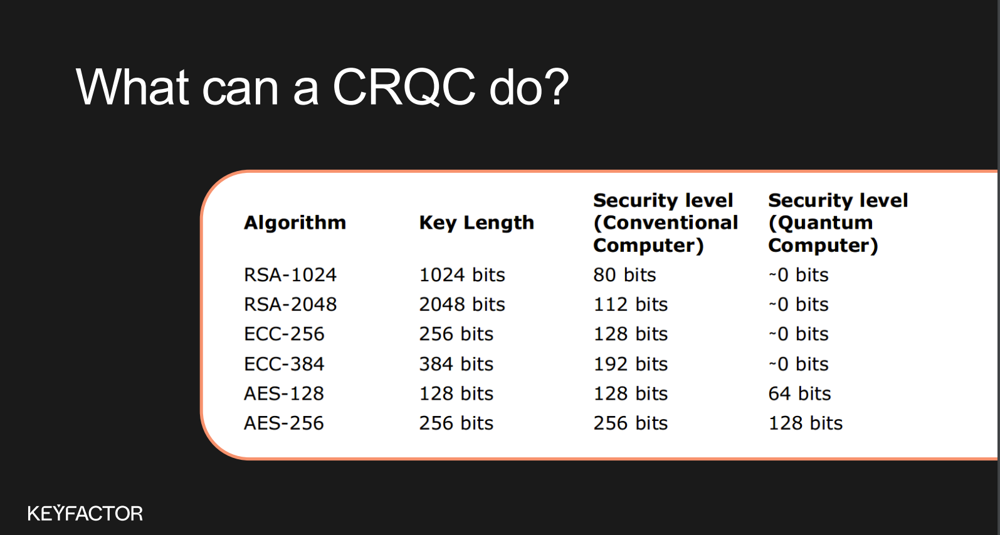
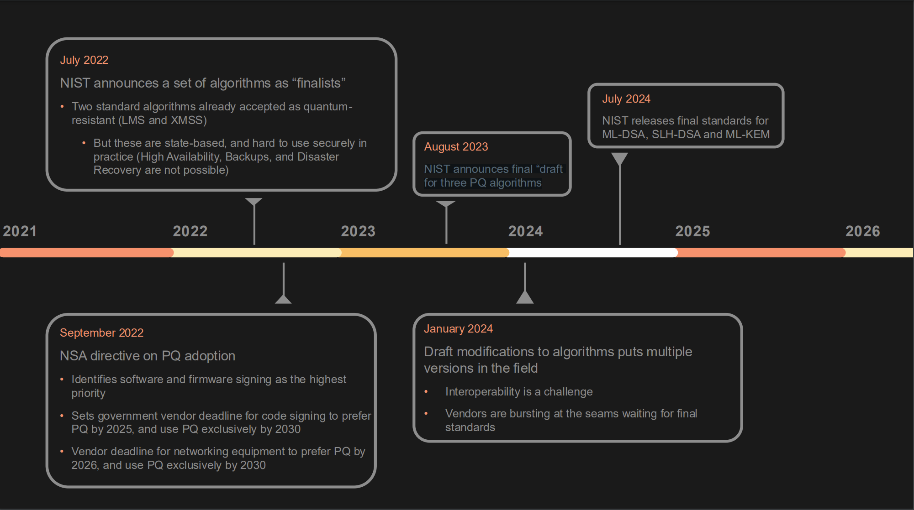
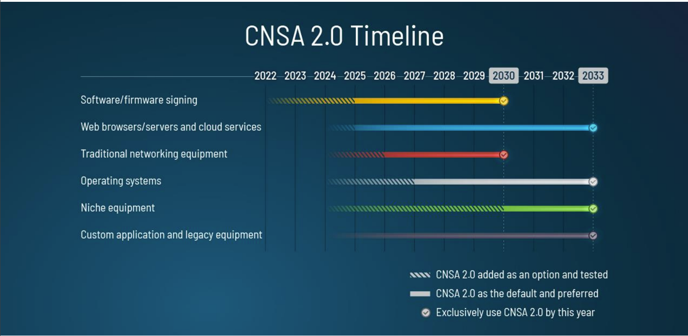
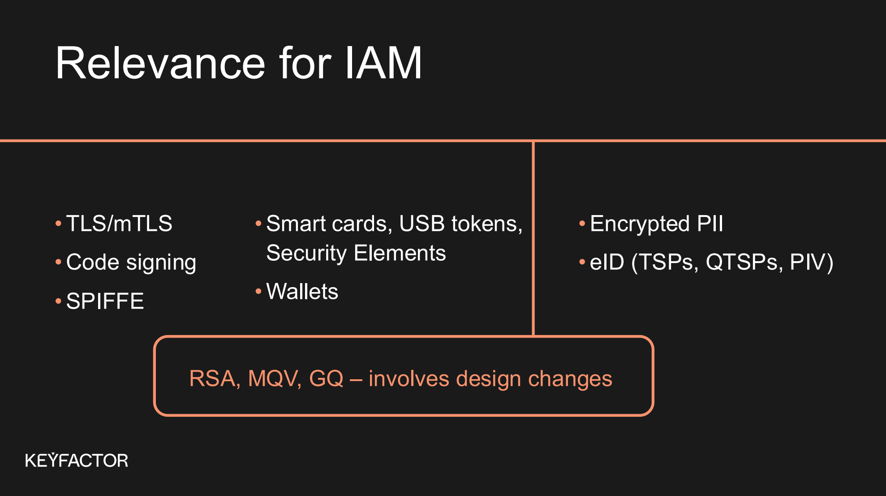
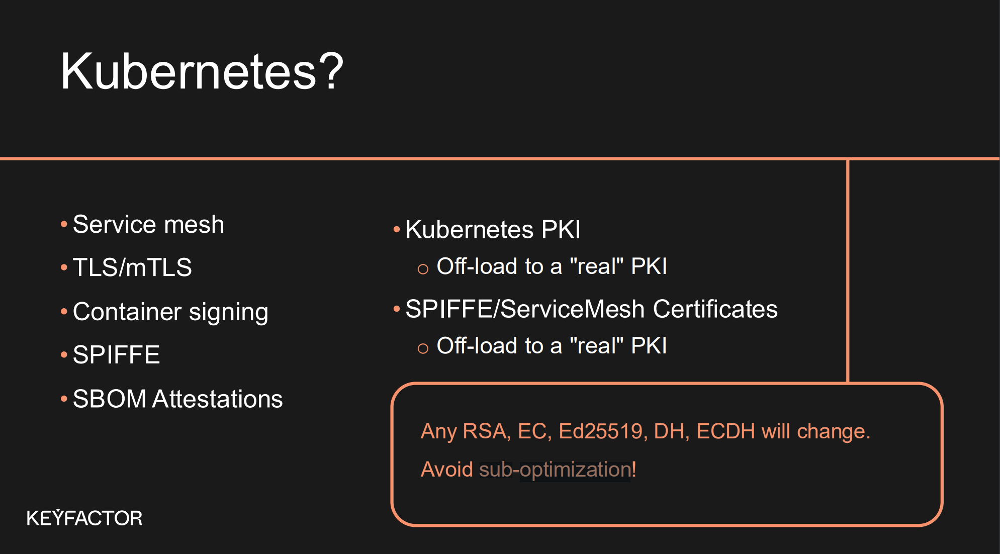
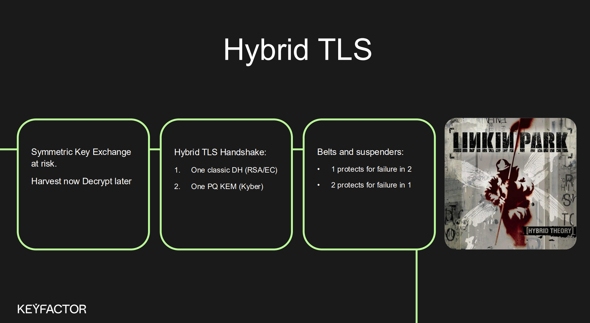
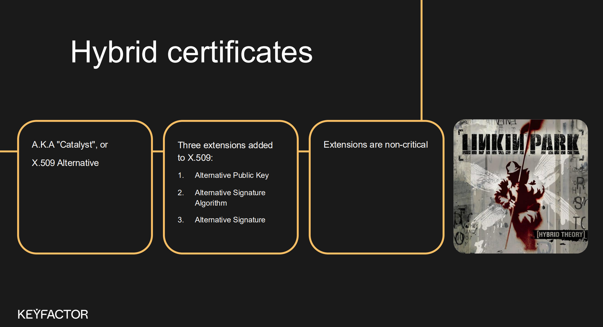
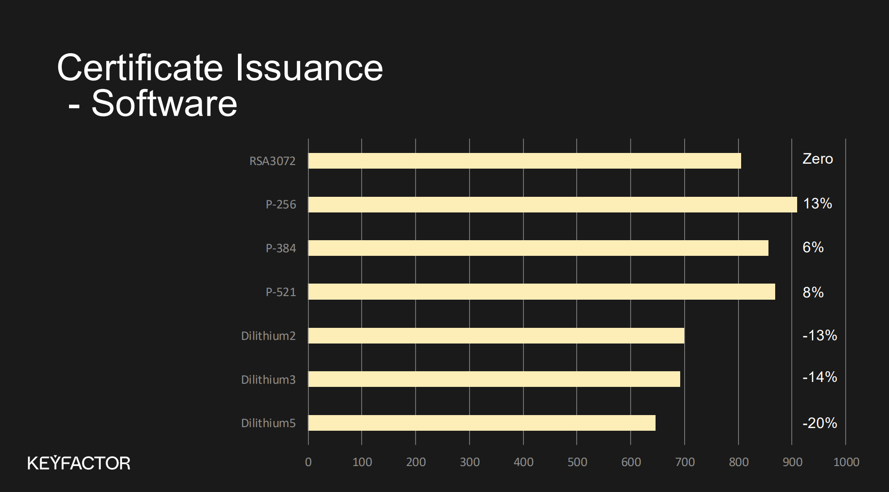
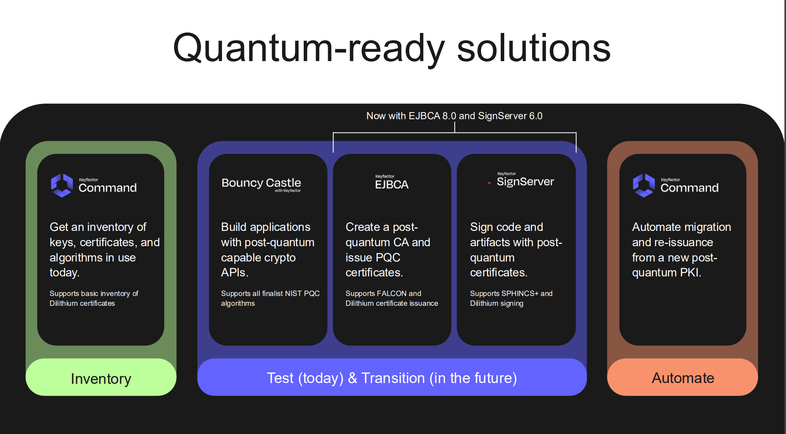

---

tags: 云原生安全资讯,安全会议,CNCF,K8S
author: noirfate
spec: v0.1.1
version: v0.1.0

---

# [CloudNativeCon North America 2024]: Navigating the Quantum Readiness Journey: Securing Kubernetes with Quantum-Resistant Cryptography

| Item            | Content        | Note     |
|-----------------|----------------|----------|
| Talk Name   | Navigating the Quantum Readiness Journey: Securing Kubernetes with Quantum-Resistant Cryptography |
| Conference Name | CloudNativeCon North America 2024 |
| Talker          |  Tomas Gustavsson  |
| Date            | 2024-06-26 |
| Materials       | [schedule](https://cloudnativesecurityconna24.sched.com/event/1dCUC/navigating-the-quantum-readiness-journey-securing-kubernetes-with-quantum-resistant-cryptography-tomas-gustavsson-keyfactor)   |
|                 | [video](https://youtu.be/kIrBL32Kjd8)      |
|                 | [slide](https://static.sched.com/hosted_files/cloudnativesecurityconna24/91/Tomas%20Gustavsson-Quantum-Resistant-Cryptography-Seattle-2024.pdf)      |

## 1. What
本演讲介绍了量子计算机对传统密码学，特别是对非对称加密算法带来的威胁，以及如何应对

### 术语
- CRQC
该词为`Cryptographically Relevant Quantum Computer`的缩写，表示密码学量子计算机
- Security Level
安全级别通常用比特（bits）表示，指的是破解一个加密算法所需的计算复杂度的对数尺度，例如：`RSA 1024`的安全级别为80比特，意为需要2的80次幂的计算次数才能破解，这个计算次数依赖于破解算法，比如数域筛选法（Number Field Sieve，NFS）
- PQ
PQ是`Post-Quantum`的缩写，中文意思是`后量子`
- PQC
`Post-Quantum Cryptography`意为`后量子密码学`，它研究在量子计算时代仍然安全的加密算法
- NIST
`NIST`是`National Institute of Standards and Technology`的缩写，指美国国家标准与技术研究院
- KEM
`KEM`是`Key Encapsulation Mechanism`的缩写，指密钥封装机制，它的流程如下：
    1. 密钥生成（Key Generation）：生成一对公私钥
    2. 密钥封装（Encapsulation）：利用接收方的公钥，发送方生成一个随机会话密钥，并产生一个密文，发送给接收方
    3. 密钥解封装（Decapsulation）：接收方使用自己的私钥，从密文中解出会话密钥
- CNSA
`CNSA`是`Commercial National Security Algorithm Suite`的缩写，指由美国国家安全局（NSA）指定的商用国家安全算法套件

## 2. Situation
### CRQC对现有加密算法带来的风险

### NIST后量子密码研究

NIST其实从2016年就开始了PQC标准的研究，在2024年8月13日发布了最终标准[FIPS 203](https://csrc.nist.gov/pubs/fips/203/final)、[FIPS 204](https://csrc.nist.gov/pubs/fips/204/final)、[FIPS 205](https://csrc.nist.gov/pubs/fips/205/final)，公布了3个PQC：

- ML-KEM
`ML-KEM`是指基于模块学习误差问题（Module Learning with Errors，MLWE）的密钥封装机制（Key Encapsulation Mechanism，KEM），代表算法为`CRYSTALS-Kyber`，下面表格中的`Size`的单位是字节

| Parameter | Encapsulation Key Size | Decapsulation Key Size |	Ciphertext Size | Shared Key Size |
| ---- | ---- | ---- | ---- | ---- |
| ML-KEM-512 | 800 | 1,632 | 768 | 32 |
| ML-KEM-768 | 1,184 | 2,400 | 1,088 | 32 |
| ML-KEM-1024 | 1,568 | 3,168 | 1,568 | 32 |

- ML-DSA
`ML-DSA`是指基于模块学习误差问题（Module Learning with Errors, MLWE）的数字签名算法（Digital Signature Algorithm, DSA），代表算法为`CRYSTALS-Dilithium`，下面表格中的`Size`的单位是字节

| Parameter | Private Key Size | Public Key Size | Signature Size |
| ---- | ---- | ---- | ---- |
| ML-DSA-44 | 2,560 | 1,312 | 2,420 |
| ML-DSA-65 | 4,032 | 1,952 | 3,309 |
| ML-DSA-87 | 4,896 | 2,592 | 4,627 |

- SLH-DSA
`SLH-DSA`是指无状态哈希签名算法（Stateless Hash-based Digital Signature Algorithm），与传统的有状态哈希签名算法不同，无状态哈希签名不需要在签名过程中维护和更新状态，这使得它们在实际应用中更加方便和安全，代表算法为`SPHINCS+`，下面表格中的`Size`的单位是字节

| Parameter | Security Category | Public Key size | Signature Size |
| ---- | ---- | ---- | ---- |
| SLH-DSA-SHA2-128s SLH-DSA-SHAKE-128s | 1 | 32 | 7,856 |
| SLH-DSA-SHA2-128f SLH-DSA-SHAKE-128f | 1 | 32 | 17,088 |
| SLH-DSA-SHA2-192s SLH-DSA-SHAKE-192s | 3 | 48 | 16,224 |
| SLH-DSA-SHA2-192f SLH-DSA-SHAKE-192f | 3 | 48 | 35,664 |
| SLH-DSA-SHA2-256s SLH-DSA-SHAKE-256s | 5 | 64 | 29,792 |
| SLH-DSA-SHA2-256f SLH-DSA-SHAKE-256f | 5 | 64 | 49,856 |

### CNSA 2.0
在[CNSA 2.0](https://media.defense.gov/2022/Sep/07/2003071834/-1/-1/0/CSA_CNSA_2.0_ALGORITHMS_.PDF)中，NSA给出了国家采购中要求供应商实现的密码算法，并给出了时间线

## 3. How
### 变化
- IAM变化

- k8s变化

### 过渡方案
- 混合TLS
结合传统的ECDH和后量子密钥交换算法Kyber，在AWS上已经支持了，参考[Using hybrid post-quantum TLS with AWS KMS](https://docs.aws.amazon.com/kms/latest/developerguide/pqtls.html)

- 混合证书
给X.509证书增加了三个非关键扩展（替代密钥、替代签名算法、替代签名）以支持PQC

### PQC性能消耗
- 证书签发性能（每秒签发证书数量）

- TLS性能
在传输大量数据时，低丢包、低或高带宽的连接将几乎不受后量子握手的影响，连接传输的数据越多，影响就越小，参考：[The impact of data-heavy, post-quantum TLS 1.3 on the Time-To-Last-Byte of real-world connections](https://csrc.nist.gov/csrc/media/Events/2024/fifth-pqc-standardization-conference/documents/papers/the-impact-of-data-heavy-post-quantum.pdf)
### EJBCA
支持PQC的开源CA
